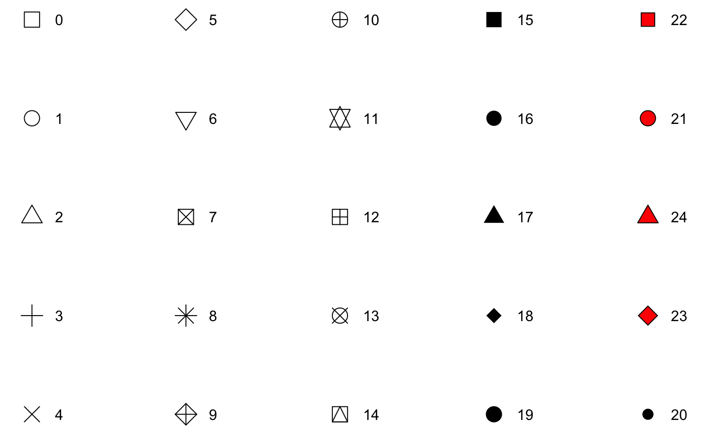
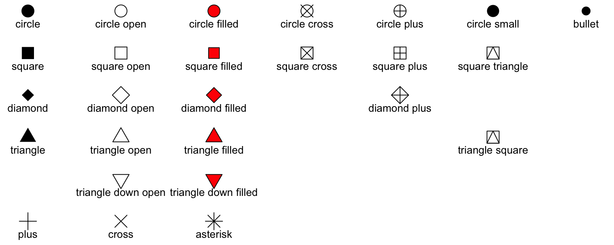

Материалы воркшопа в репозитории <https://github.com/baltti/workshop-DH21> и в канале <https://t.me/geomess>.

Проект в RStudio cloud: <https://rstudio.cloud/project/2100280>

```{r setup, include=TRUE, echo=TRUE, message=FALSE, warning=FALSE}
knitr::opts_chunk$set(echo = FALSE)
if(!require(tidyverse)) {install.packages("tidyverse")
  require(tidyverse)}
```

Большая часть воркшопа построена на базе нескольких туториалов:

1.  [A ggplot2 Tutorial for Beautiful Plotting in R](https://www.cedricscherer.com/2019/08/05/a-ggplot2-tutorial-for-beautiful-plotting-in-r/)

2.  [Drawing Anything with ggplot2](https://github.com/thomasp85/ggplot2_workshop)

3.  [Creating and using custom ggplot2 themes](https://themockup.blog/posts/2020-12-26-creating-and-using-custom-ggplot2-themes/)

4.  [Materials for the virtual ggplot2 tutorial for useR2020](https://github.com/sctyner/useR2020-ggplot2)

Также в качестве ресурса воспользовалась галереей графиков [The R Graph Gallery](https://www.r-graph-gallery.com/) и, конечно, материалами с сайта пакета [ggplot2](https://ggplot2.tidyverse.org/)

# Основные понятия и философия пакета

Пакет `ggplot2` построен на основе "грамматики графики" (grammar of graphics), принципы которой были сформулированы в книге **Леланда Уилкинсона "The grammar of graphics"**.

Фактически в пакете `ggplot2` все элементы графики рассматриваются как самостоятельные слои, которые можно накладывать друг на друга и адаптировать независимо друг от друга (в определенных пределах).

```{r elements, out.width='75%', fig.align='center', fig.cap='...', echo=FALSE}
knitr::include_graphics('img/grammar of graphics.png')
```

-   *Data* - данные, которые нужно отобразить.

-   *Geometries geom\_* - фигуры, которые будут отображать данные.

-   *Aesthetics aes()* -эстетика или параметры геометрических объектов (расположение, цвет, размер, форма, прозрачность)

-   *Scales scale\_* - мостик между данными и эстетическими параметрами (например, цветовая шкала)

-   *Statistical transformations stat\_* - статистические сводки данных (квантили, сумма и прочее)

-   *Coordinate system coord\_* - система координат для отображения на графике

-   *Facets facet\_* - расположение графиков в виде сетки

-   *Visual themes theme()* - общее оформление графика (фон, сетка, оси, шрифты и прочее)

Одно из условий успешной работы грамматики графики - "чистые" (tidy) данные.

```{r tidy, out.width='100%', fig.align='center', fig.cap='...', echo=FALSE}
knitr::include_graphics('img/tidydata_1.jpg')
```

by [Allison Horst](https://github.com/allisonhorst/stats-illustrations)

Кроме основного пакета существует еще очень большое количество его расширений, которые наследуют общие принципы, но добавляют новые геометрии, темы, дополнительные возможности для графиков и прочее.
Перечень этих расширений можно посмотреть [здесь](https://exts.ggplot2.tidyverse.org/).

```{r masterpiece, out.width='100%', fig.align='center', fig.cap='...', echo=FALSE}
knitr::include_graphics('img/ggplot2_masterpiece.png')
```

by [Allison Horst](https://github.com/allisonhorst/stats-illustrations)

В качестве основного датасета для работы используются данные о пингвинах со станции Палмер.
Эти данные собраны в пакет [palmerpenguins](https://allisonhorst.github.io/palmerpenguins/).
В датасете сожержатся данные о трех видах пингвинов и их параметрах:

-   длина клюва

-   глубина клюва

-   длина ласта

-   масса тела

-   пол

```{r penguins, echo=TRUE, collapse=TRUE, message=FALSE, warning=FALSE}
if(!require(palmerpenguins)) {install.packages("palmerpenguins")
  require(palmerpenguins)}

knitr::kable(head(penguins))
```

Попробуем создать простой график, указав датасет для построений и переменные, которые мы хотим отобразить.

```{r out.width='100%', message=FALSE, warning=FALSE, echo=TRUE}
ggplot(penguins, aes(x=bill_length_mm,y=bill_depth_mm))
```

Получена просто пустая панель графика с обозначением осей, но нет собственно графика.
Так произошло потому, что не был указан тип геометрии `geom_`, который нужно построить.

------------------------------------------------------------------------

# Виды графиков

## Диаграмма рассеяния (scatter plot)

Чуть выше уже были прописаны основные параметры графика, не хватало только главного: типа геометрии, который нужно показать на графике.
Для диаграммы рассеяния это `geom_point`

```{r scatterplot, out.width='100%', message=FALSE, warning=FALSE, echo=TRUE}
ggplot(penguins)+
  geom_point(aes(x=bill_length_mm,y=bill_depth_mm))
```

Для каждого типа геометрии `geom_` есть несколько настроек эстетики `aes`, часть из которых обязательна, то есть без их указания график строится не будет.

Для точек `geom_point` обязательными являются x и y.
Если их не указать, то функция выдаст ошибку `Error: geom_point requires the following missing aesthetics: x and y`

### Тип символа

Попробуем модифицировать график.
Изменим размер и форму точек.

```{r out.width='100%', message=FALSE, warning=FALSE, echo=TRUE}
ggplot(penguins)+
  geom_point(aes(x=bill_length_mm,y=bill_depth_mm), size=3, shape="diamond")
```

Тип символа может быть указан двумя способами: целым числом от нуля до 25 или названием символа.

Нумерация типов точек:

```{r out.width='100%', fig.align='center', fig.cap='...', echo=FALSE}

```

Названия типов точек:

```{r out.width='100%', fig.align='center', fig.cap='...', echo=FALSE}

```

Тип символа можно также задать на основе переменной, например, в нашем случае в зависимости от вида пингвина

```{r out.width='100%', message=FALSE, warning=FALSE, echo=TRUE}
ggplot(penguins)+
  geom_point(aes(x=bill_length_mm,y=bill_depth_mm,shape=species), size=3)
```

Также можно настроить какой вид каким символом будет показан на графике.

```{r out.width='100%', message=FALSE, warning=FALSE, echo=TRUE}
ggplot(penguins)+
  geom_point(aes(x=bill_length_mm,y=bill_depth_mm,shape=species), size=3)+
  scale_shape(solid = FALSE)
```

```{r out.width='100%', message=FALSE, warning=FALSE, echo=TRUE}
ggplot(penguins)+
  geom_point(aes(x=bill_length_mm,y=bill_depth_mm,shape=species), size=3)+
  scale_shape_manual(values = c("plus","cross","asterisk"))
```

### Цвета и цветовые шкалы

Цвет точек на графике можно задать различными способами: просто указать цвет или указать цвет на основе какой-то характеристики.

```{r out.width='100%', message=FALSE, warning=FALSE, echo=TRUE}
#задание цвета описательно
ggplot(penguins)+
  geom_point(aes(x=bill_length_mm,y=bill_depth_mm), color="red")

#задание цвета через 16-тиричное кодирование
ggplot(penguins)+
  geom_point(aes(x=bill_length_mm,y=bill_depth_mm), color="#ec3713")
```

Можно отдельно задать цвета заливки и контура.

```{r out.width='100%', message=FALSE, warning=FALSE, echo=TRUE}
ggplot(penguins)+
  geom_point(aes(x=bill_length_mm,y=bill_depth_mm), 
             shape = 21, #тип символа
             size = 2, #размер символа
             stroke = 1, #толщина контура
             color="yellow", #цвет контура
             fill="blue") #цвет заливки

```

Добавим цвета точек в зависимости от переменной

```{r out.width='100%', message=FALSE, warning=FALSE, echo=TRUE}
#задание отдельных цветов для различных групп точек (в данном случае нам известны группы - это виды пингвинов)
ggplot(penguins)+
  geom_point(aes(x=bill_length_mm,y=bill_depth_mm, color=species))
```

Виды пингвинов - это качественная переменная.
Эту цветовую шкалу можно далее модифицировать по необходимости.

Можно задать шкалу вручную.

```{r out.width='100%', message=FALSE, warning=FALSE, echo=TRUE}
ggplot(penguins)+
  geom_point(aes(x=bill_length_mm,y=bill_depth_mm, color=species))+
  scale_color_manual(values = c("#19a6b3","#f26c0d","#5e3894"))
```

Либо использовать существующую цветовую шкалу.
Например, на основе [ColorBrewer палитр](http://colorbrewer2.org/).
Для этого необходим пакет `RColorBrewer` и функция `scale_*_brewer()`

```{r out.width='100%', message=FALSE, warning=FALSE, echo=TRUE}
if(!require(RColorBrewer)) {install.packages("RColorBrewer")
  require(RColorBrewer)}

ggplot(penguins)+
  geom_point(aes(x=bill_length_mm,y=bill_depth_mm, color=species))+
  scale_color_brewer(palette = "Set1")
```

Все доступные палитры можно посмотреть с помощью функции `RColorBrewer::display.brewer.all()`.

Кроме этого пакета можно воспользоваться различными пакетами-расширениями с готовыми палитрами, например, [`paletteer`](https://github.com/EmilHvitfeldt/paletteer) или пакетом с готовым набором тем и палитр [`ggthemes`](https://jrnold.github.io/ggthemes/)

```{r out.width='100%', message=FALSE, warning=FALSE, echo=TRUE}
if(!require(ggthemes)) {install.packages("ggthemes")
  require(ggthemes)}

ggplot(penguins)+
  geom_point(aes(x=bill_length_mm,y=bill_depth_mm, color=species))+
  scale_color_tableau()
```

Есть пакет с палитрами, вдохновленными научными публикациями и научной фантастикой [`ggsci`](https://cran.r-project.org/web/packages/ggsci/vignettes/ggsci.html)

Кроме категорийной переменной цвета также можно задавать и с использованием числовых переменных

```{r out.width='100%', message=FALSE, warning=FALSE, echo=TRUE}
ggplot(penguins)+
  geom_point(aes(x=bill_length_mm,y=bill_depth_mm, color=bill_length_mm))
```

В этом случае числовая переменная будет рассматриваться как непрерывная и параметры цветовой шкалы можно функцией `scale_color_continuous`, `scale_color_gradient` или `scale_color_gradient2` (последняя позволяет создать шкалу для отображения противоположных значений diverging scale).

```{r out.width='100%', message=FALSE, warning=FALSE, echo=TRUE}
ggplot(penguins)+
  geom_point(aes(x=bill_length_mm,y=bill_depth_mm, color=bill_length_mm))+
  scale_color_gradient(low = "yellow",high = "red")
```

```{r out.width='100%', message=FALSE, warning=FALSE, echo=TRUE}
ggplot(penguins)+
  geom_point(aes(x=bill_length_mm,y=bill_depth_mm, color=bill_length_mm))+
  scale_color_gradient2(midpoint = 45)
```

```{r out.width='100%', message=FALSE, warning=FALSE, echo=TRUE}
ggplot(penguins)+
  geom_point(aes(x=bill_length_mm,y=bill_depth_mm, color=bill_length_mm))+
  scale_color_gradient2(midpoint = 45, low = "blue",mid = "green",high = "red")
```

Кроме того, можно воспользоваться готовыми палитрами [`viridis`](https://cran.r-project.org/web/packages/viridis/vignettes/intro-to-viridis.html) с помощью функций `scale_color_viridis_c` (для непрерывных величин) `scale_color_viridis_d` (для дискретных величин)

```{r out.width='100%', message=FALSE, warning=FALSE, echo=TRUE}
ggplot(penguins)+
  geom_point(aes(x=bill_length_mm,y=bill_depth_mm, color=bill_length_mm))+
  scale_color_viridis_c()
```

### Темы оформления

Все предыдущие графики были построены с использованием темы по умолчанию, которую можно поменять на одну из встроенных тем или добавить тему оформления из пакета-расширения, а также модифицировать на свое усмотрение

Замена темы оформления на одну из встроенных.

```{r out.width='100%', message=FALSE, warning=FALSE, echo=TRUE}
ggplot(penguins)+
  geom_point(aes(x=bill_length_mm,y=bill_depth_mm, color=species))+
  scale_color_manual(values = c("#19a6b3","#f26c0d","#5e3894"))+
  theme_bw()
```

Это немного другая запись, но результат такой же, как и в предыдущем варианте.

```{r out.width='100%', message=FALSE, warning=FALSE, echo=TRUE}
theme_set(theme_minimal())

ggplot(penguins)+
  geom_point(aes(x=bill_length_mm,y=bill_depth_mm, color=species))+
  scale_color_manual(values = c("#19a6b3","#f26c0d","#5e3894"))
```

Воспользуемся темой оформления из пакета `ggthemes`.

```{r out.width='100%', message=FALSE, warning=FALSE, echo=TRUE}
ggplot(penguins)+
  geom_point(aes(x=bill_length_mm,y=bill_depth_mm, color=species))+
  scale_color_manual(values = c("#19a6b3","#f26c0d","#5e3894"))+
  theme_economist()
```

Кроме использования существующих тем, можно отдельные элементы настраивать по желанию с помощью функции `theme`.
Все возможные компоненты можно посмотреть в документации [здесь](https://ggplot2.tidyverse.org/reference/theme.html)

### Названия и подписи осей графика

Добавим названия осей

```{r out.width='100%', message=FALSE, warning=FALSE, echo=TRUE}
ggplot(penguins)+
  geom_point(aes(x=bill_length_mm,y=bill_depth_mm, color=species))+
  scale_color_manual(values = c("#19a6b3","#f26c0d","#5e3894"))+
  theme_bw()+
  labs(x="Длина клюва, мм",y="Толщина клюва, мм")
```

Либо названия осей могут быть заданы отдельно функциями `xlab()` и `ylab()`.

```{r out.width='100%', message=FALSE, warning=FALSE, echo=TRUE}
ggplot(penguins)+
  geom_point(aes(x=bill_length_mm,y=bill_depth_mm, color=species))+
  scale_color_manual(values = c("#19a6b3","#f26c0d","#5e3894"))+
  theme_bw()+
  xlab("Длина клюва, мм")+
  ylab("Толщина клюва, мм")
```

Как уже было сказано выше отдельные элементы оформления могут быть модифицированы функцией `theme`.
Изменим расположение названий осей и размер.
Так как здесь будут меняться параметры текста, то необходимо использовать функцию `element_text()`.

```{r out.width='100%', message=FALSE, warning=FALSE, echo=TRUE}
ggplot(penguins)+
  geom_point(aes(x=bill_length_mm,y=bill_depth_mm, color=species))+
  scale_color_manual(values = c("#19a6b3","#f26c0d","#5e3894"))+
  theme_bw()+
  labs(x="Длина клюва, мм",y="Толщина клюва, мм")+
  theme(axis.title.x = element_text(vjust = 0, #выравнивание по вертикали (от 0 до 1)
                                    size = 15),
        axis.title.y = element_text(vjust = 2, size = 15))
```

Также расположение названий можно изменить указав отступы.

```{r out.width='100%', message=FALSE, warning=FALSE, echo=TRUE}
ggplot(penguins)+
  geom_point(aes(x=bill_length_mm,y=bill_depth_mm, color=species))+
  scale_color_manual(values = c("#19a6b3","#f26c0d","#5e3894"))+
  theme_bw()+
  labs(x="Длина клюва, мм",y="Толщина клюва, мм")+
  theme(axis.title.x = element_text(margin = margin(t=20), size = 15),
        axis.title.y = element_text(margin = margin(r=10), size = 15))
```

В случае использования `margin` буквы t и r ссылаются на верхний отступ и отступ справа (top и right).
Можно указать отступы со всех сторон как `margin(t, r, b, l)`.

Также, как и для прочих элементов графика, можно изменить цвет шрифта.
В этом варианте поменяем характеристики шрифта сразу для обеих осей.

```{r out.width='100%', message=FALSE, warning=FALSE, echo=TRUE}
ggplot(penguins)+
  geom_point(aes(x=bill_length_mm,y=bill_depth_mm, color=species))+
  scale_color_manual(values = c("#19a6b3","#f26c0d","#5e3894"))+
  theme_bw()+
  labs(x="Длина клюва, мм",y="Толщина клюва, мм")+
  theme(axis.title = element_text(size = 15, 
                                  color = "red", 
                                  face = "italic"))
```

Названия осей можно менять и независимо друг от друга

```{r out.width='100%', message=FALSE, warning=FALSE, echo=TRUE}
ggplot(penguins)+
  geom_point(aes(x=bill_length_mm,y=bill_depth_mm, color=species))+
  scale_color_manual(values = c("#19a6b3","#f26c0d","#5e3894"))+
  theme_bw()+
  labs(x="Длина клюва, мм",y="Толщина клюва, мм")+
  theme(axis.title.x = element_text(color = "sienna", size = 15, face="italic"),
        axis.title.y = element_text(color = "orangered", size = 20))
```

Кроме названий можно кастомизировать и подписи осей, например, изменить цвет и написание.

```{r out.width='100%', message=FALSE, warning=FALSE, echo=TRUE}
ggplot(penguins)+
  geom_point(aes(x=bill_length_mm,y=bill_depth_mm, color=species))+
  scale_color_manual(values = c("#19a6b3","#f26c0d","#5e3894"))+
  theme_bw()+
  labs(x="Длина клюва, мм",y="Толщина клюва, мм")+
  theme(axis.text = element_text(color = "blue", size = 12),
        axis.text.x = element_text(face = "italic"))
```

Здесь важно помнить, что `axis.text.x` наследует характеристики от `axis.text`.

Подписи осей можно при необходимости повернуть

```{r out.width='100%', message=FALSE, warning=FALSE, echo=TRUE}
ggplot(penguins)+
  geom_point(aes(x=bill_length_mm,y=bill_depth_mm, color=species))+
  scale_color_manual(values = c("#19a6b3","#f26c0d","#5e3894"))+
  theme_bw()+
  labs(x="Длина клюва, мм",y="Толщина клюва, мм")+
  theme(axis.text.x = element_text(angle = 50, vjust = 1, hjust = 1, size = 12))
```

Подписи осей можно добавить с помощью функции, чтобы добавить единицы измерения

```{r out.width='100%', message=FALSE, warning=FALSE, echo=TRUE}
ggplot(penguins)+
  geom_point(aes(x=bill_length_mm,y=bill_depth_mm, color=species))+
  scale_color_manual(values = c("#19a6b3","#f26c0d","#5e3894"))+
  theme_bw()+
  labs(x="Длина клюва, мм",y="Глубина клюва")+
  scale_y_continuous(label = function(x) {return(paste(x, "мм"))}) 
```

Если подписи осей и отметки не нужны, их можно убрать с графика

```{r out.width='100%', message=FALSE, warning=FALSE, echo=TRUE}
ggplot(penguins)+
  geom_point(aes(x=bill_length_mm,y=bill_depth_mm, color=species))+
  scale_color_manual(values = c("#19a6b3","#f26c0d","#5e3894"))+
  theme_bw()+
  labs(x="Длина клюва, мм",y="Толщина клюва, мм")+
  theme(axis.ticks.y = element_blank(),
        axis.text.y = element_blank())
```

Здесь `element_blank()` удаляет ненужный элемент темы.

Названия осей можно удалить двумя способами: либо через функцию `theme()` и `element_blank()`, либо более простым способом через функцию `labs()` или `xlab()`/`ylab()`

```{r out.width='100%', message=FALSE, warning=FALSE, echo=TRUE}
ggplot(penguins)+
  geom_point(aes(x=bill_length_mm,y=bill_depth_mm, color=species))+
  scale_color_manual(values = c("#19a6b3","#f26c0d","#5e3894"))+
  theme_bw()+
  labs(x=NULL,y="")
```

Здесь `NULL` удаляет элемент, а пустые кавычки `""` оставляют место для этого элемента и просто ничего не печатают.

Отметки на осях также можно модифицировать с помощью аргумента `breaks` функции `scale_x_continuous/scale_y_continuous`

```{r out.width='100%', message=FALSE, warning=FALSE, echo=TRUE}
ggplot(penguins)+
  geom_point(aes(x=bill_length_mm,y=bill_depth_mm, color=species))+
  scale_color_manual(values = c("#19a6b3","#f26c0d","#5e3894"))+
  theme_bw()+
  labs(x="Длина клюва, мм",y="Толщина клюва, мм")+
  scale_x_continuous(breaks = c(30,35,40,45,50,55,60))
```

### Система координат

Кроме названий осей и подписей систему координат можно менять (например, с прямоугольной на полярную), изменять диапазон осей (если необходимо показать какой-то фрагмент крупнее), поменять соотношение осей.

Изменить диапазон по какой-либо из осей можно двумя способами: функциями `scale_x_continuous(limits=c(40,50))/scale_y_continuous(limits=c(15,20))` или `xlim/ylim` (аналогичный результат будет получен, если использовать функцию `coord_cartesian(xlim=c(40,50))/coord_cartesian(ylim=c(15,20))`).
Главная разница между этими способами в том, что первый вариант фильтрует данные по заданным границам диапазона, а второй просто увеличивает фрагмент/обрезает график по осям.
На точечном графике разница возможно не очень заметно, но далее еще раз будет показано на более наглядном примере.

```{r out.width='100%', message=FALSE, warning=FALSE, echo=TRUE}
ggplot(penguins)+
  geom_point(aes(x=bill_length_mm,y=bill_depth_mm, color=species))+
  scale_color_manual(values = c("#19a6b3","#f26c0d","#5e3894"))+
  theme_bw()+
  labs(x="Длина клюва, мм",y="Толщина клюва, мм")+
  scale_x_continuous(limits=c(40,50))+
  scale_y_continuous(limits=c(15,20))

ggplot(penguins)+
  geom_point(aes(x=bill_length_mm,y=bill_depth_mm, color=species))+
  scale_color_manual(values = c("#19a6b3","#f26c0d","#5e3894"))+
  theme_bw()+
  labs(x="Длина клюва, мм",y="Толщина клюва, мм")+
  coord_cartesian(xlim=c(40,50),ylim=c(15,20))
```

Видно, что точки, находящиеся по краям графика в первом варианте пропали.

Сделать график, начинающимся от нуля по осям, можно несколькими способами.
Например, указав, что границы графика нужно расширить функцией `expand`.

```{r out.width='100%', message=FALSE, warning=FALSE, echo=TRUE}
ggplot(penguins)+
  geom_point(aes(x=bill_length_mm,y=bill_depth_mm, color=species))+
  scale_color_manual(values = c("#19a6b3","#f26c0d","#5e3894"))+
  theme_bw()+
  labs(x="Длина клюва, мм",y="Толщина клюва, мм")+
  expand_limits(x = 0, y = 0)
```

Или указав пределы координат

```{r out.width='100%', message=FALSE, warning=FALSE, echo=TRUE}
ggplot(penguins)+
  geom_point(aes(x=bill_length_mm,y=bill_depth_mm, color=species))+
  scale_color_manual(values = c("#19a6b3","#f26c0d","#5e3894"))+
  theme_bw()+
  labs(x="Длина клюва, мм",y="Толщина клюва, мм")+
  coord_cartesian(xlim = c(0, NA), ylim = c(0, NA))
```

Или есть еще третий вариант

```{r out.width='100%', message=FALSE, warning=FALSE, echo=TRUE}
ggplot(penguins)+
  geom_point(aes(x=bill_length_mm,y=bill_depth_mm, color=species))+
  scale_color_manual(values = c("#19a6b3","#f26c0d","#5e3894"))+
  theme_bw()+
  labs(x="Длина клюва, мм",y="Толщина клюва, мм")+
  expand_limits(x = 0, y = 0) +
  scale_x_continuous(expand = c(0, 0)) +
  scale_y_continuous(expand = c(0, 0)) +
  coord_cartesian(clip = "off")
```

Кроме этого можно настроить соотношение осей.
Функция `coord_fixed()` - задает систему координат с определенным соотношением между осями, по умолчанию это соотношение 1.

```{r out.width='100%', message=FALSE, warning=FALSE, echo=TRUE}
ggplot(penguins)+
  geom_point(aes(x=bill_length_mm,y=bill_depth_mm, color=species))+
  scale_color_manual(values = c("#19a6b3","#f26c0d","#5e3894"))+
  theme_bw()+
  labs(x="Длина клюва, мм",y="Толщина клюва, мм")+
  coord_fixed()
```

Если это соотношение сделать больше единицы, то размерность по оси y увеличится по отношению к размерности по оси x и наоборот.

```{r out.width='100%', message=FALSE, warning=FALSE, echo=TRUE}
ggplot(penguins)+
  geom_point(aes(x=bill_length_mm,y=bill_depth_mm, color=species))+
  scale_color_manual(values = c("#19a6b3","#f26c0d","#5e3894"))+
  theme_bw()+
  labs(x="Длина клюва, мм",y="Толщина клюва, мм")+
  coord_fixed(ratio = 4)
```

```{r out.width='100%', message=FALSE, warning=FALSE, echo=TRUE}
ggplot(penguins)+
  geom_point(aes(x=bill_length_mm,y=bill_depth_mm, color=species))+
  scale_color_manual(values = c("#19a6b3","#f26c0d","#5e3894"))+
  theme_bw()+
  labs(x="Длина клюва, мм",y="Толщина клюва, мм")+
  coord_fixed(ratio = 1/2)
```

Шаг сетки координат можно задать вручную

```{r out.width='100%', message=FALSE, warning=FALSE, echo=TRUE}
ggplot(penguins)+
  geom_point(aes(x=bill_length_mm,y=bill_depth_mm, color=species))+
  scale_color_manual(values = c("#19a6b3","#f26c0d","#5e3894"))+
  theme_bw()+
  labs(x="Длина клюва, мм",y="Толщина клюва, мм")+
  scale_x_continuous(breaks = seq(30, 60, 10),
                     minor_breaks = seq(30, 60, 1))+
  scale_y_continuous(breaks = seq(10, 25, 5),
                     minor_breaks = seq(10, 25, 0.2))
```

### Заголовки

Заголовок можно добавить функцией `ggtitle()`

```{r out.width='100%', message=FALSE, warning=FALSE, echo=TRUE}
ggplot(penguins)+
  geom_point(aes(x=bill_length_mm,y=bill_depth_mm, color=species))+
  scale_color_manual(values = c("#19a6b3","#f26c0d","#5e3894"))+
  theme_bw()+
  labs(x="Длина клюва, мм",y="Толщина клюва, мм")+
  ggtitle("Характеристики видов пингвинов")
```

Или прописать как дополнительные аргументы в функции `labs()`

```{r out.width='100%', message=FALSE, warning=FALSE, echo=TRUE}
ggplot(penguins)+
  geom_point(aes(x=bill_length_mm,y=bill_depth_mm, color=species))+
  scale_color_manual(values = c("#19a6b3","#f26c0d","#5e3894"))+
  theme_bw()+
  labs(x="Длина клюва, мм",y="Толщина клюва, мм",
       title = "Характеристики видов пингвинов", #основной заголовок
       subtitle = "Виды пингвинов, которые можно наблюдать на станции Палмер", #подзаголовок
       caption = "Data: Long Term Ecological Research Network", #текст в правом нижнем углу
       tag = "Рис. 1") #текст в левом верхнем углу
```

Заголовок, подзаголовок и прочие подписи настраиваются через функцию `theme()`.
Настраивать заголовок и подзаголовок можно независимо друг от друга (`plot.title` и `plot.subtitle` соответственно), но нужно помнить, что эти функции наследуют свои параметры от функции `text` (если таковая прописана в настройках темы)

```{r out.width='100%', message=FALSE, warning=FALSE, echo=TRUE}
ggplot(penguins)+
  geom_point(aes(x=bill_length_mm,y=bill_depth_mm, color=species))+
  scale_color_manual(values = c("#19a6b3","#f26c0d","#5e3894"))+
  theme_bw()+
  labs(x="Длина клюва, мм",y="Толщина клюва, мм",
       title = "Характеристики видов пингвинов", #основной заголовок
       subtitle = "Виды пингвинов, которые можно наблюдать на станции Палмер")+ #подзаголовок
  theme(plot.title = element_text(face = "bold",size = 20,color = "red"),
        plot.subtitle = element_text(face = "italic", size = 10,color = "orange"))
       
```

Функция title задает параметры всех заголовков: осей, легенды, заголовок и подзаголовок графика

```{r out.width='100%', message=FALSE, warning=FALSE, echo=TRUE}
ggplot(penguins)+
  geom_point(aes(x=bill_length_mm,y=bill_depth_mm, color=species))+
  scale_color_manual(values = c("#19a6b3","#f26c0d","#5e3894"))+
  theme_bw()+
  labs(x="Длина клюва, мм",y="Толщина клюва, мм",
       title = "Характеристики видов пингвинов", #основной заголовок
       subtitle = "Виды пингвинов, которые можно наблюдать на станции Палмер")+ #подзаголовок
  theme(title = element_text(face = "italic",size = 10,color = "red"))
       
```

Как и для названий осей можно настроить отступы вокруг заголовка

```{r out.width='100%', message=FALSE, warning=FALSE, echo=TRUE}
ggplot(penguins)+
  geom_point(aes(x=bill_length_mm,y=bill_depth_mm, color=species))+
  scale_color_manual(values = c("#19a6b3","#f26c0d","#5e3894"))+
  theme_bw()+
  labs(x="Длина клюва, мм",y="Толщина клюва, мм",
       title = "Характеристики видов пингвинов", #основной заголовок
       subtitle = "Виды пингвинов, которые можно наблюдать на станции Палмер")+ #подзаголовок
  theme(plot.title = element_text(face = "bold",size = 20,margin = margin(b=15)),
        plot.subtitle = element_text(face = "italic", size = 10))
       
```

Расположение заголовка можно изменить функциями `vjust()` и `hjust()` - вертикальное и горизонтальное выравнивание соотвественно.
В этих функциях необходимо задать местоположение заголовка от 0 до 1, где 0 - это левый край/верх, а 1 - правый край/низ

```{r out.width='100%', message=FALSE, warning=FALSE, echo=TRUE}
ggplot(penguins)+
  geom_point(aes(x=bill_length_mm,y=bill_depth_mm, color=species))+
  scale_color_manual(values = c("#19a6b3","#f26c0d","#5e3894"))+
  theme_bw()+
  labs(x="Длина клюва, мм",y="Толщина клюва, мм",
       title = "Характеристики видов пингвинов", #основной заголовок
       subtitle = "Виды пингвинов, которые можно наблюдать на станции Палмер")+ #подзаголовок
  theme(plot.title = element_text(face = "bold",size = 20,hjust = 0.5),
        plot.subtitle = element_text(face = "italic", size = 10,hjust = 1))
       
```

Кроме того можно задать положение заголовка функцией `plot.title.position` (передает параметры и основному заголовку и подзаголовку).
Здесь возможно 2 варианта расположения: `"panel"` (по умолчанию) - расположение заголовка идет относительно самой панели графика, `"plot"` - заголовок с подзаголовком будут размещены по отношению ко всему графику

```{r out.width='100%', message=FALSE, warning=FALSE, echo=TRUE}
ggplot(penguins)+
  geom_point(aes(x=bill_length_mm,y=bill_depth_mm, color=species))+
  scale_color_manual(values = c("#19a6b3","#f26c0d","#5e3894"))+
  theme_bw()+
  labs(x="Длина клюва, мм",y="Толщина клюва, мм",
       title = "Характеристики видов пингвинов", #основной заголовок
       subtitle = "Виды пингвинов, которые можно наблюдать на станции Палмер")+ #подзаголовок
  theme(plot.title = element_text(face = "bold",size = 20),
        plot.subtitle = element_text(face = "italic", size = 10),
        plot.title.position = "plot")
       
```

Чтобы изменить тип шрифта, лучше пользоваться дополнительными пакетами, например, [`showtext`](https://github.com/yixuan/showtext) или [`extrafont`](https://cran.r-project.org/web/packages/extrafont/README.html)

### Фон и линии сетки

Фон графика, а также тип основных и дополнительных линий сетки определяется выбранной темой, но по необходимости их как и прочие элементы можно настраивать на свое усмотрение внутри функции `theme()`.

Фон может быть настроен отдельно как для панели графика (`panel.background`), так и для всего графика (`plot.background`).
`panel_grid` задает характеристики сразу для всей сетки (дополнительные линии по умолчанию делаются чуть тоньше)

```{r out.width='100%', message=FALSE, warning=FALSE, echo=TRUE}
ggplot(penguins)+
  geom_point(aes(x=bill_length_mm,y=bill_depth_mm, color=species))+
  scale_color_manual(values = c("#19a6b3","#f26c0d","#5e3894"))+
  theme_bw()+
  labs(x="Длина клюва, мм",y="Толщина клюва, мм",
       title = "Характеристики видов пингвинов", #основной заголовок
       subtitle = "Виды пингвинов, которые можно наблюдать на станции Палмер")+ #подзаголовок
  theme(plot.title = element_text(face = "bold",size = 20,hjust = 0.5),
        plot.subtitle = element_text(face = "italic", size = 10,hjust = 0.5),
        plot.title.position = "plot",
        panel.background = element_rect(fill = "#deede6"),
        panel.grid = element_line(color = "#98a50d",size = 1))
       
```

Фон всего графика, как правило частично перекрывается панелью графика

```{r out.width='100%', message=FALSE, warning=FALSE, echo=TRUE}
ggplot(penguins)+
  geom_point(aes(x=bill_length_mm,y=bill_depth_mm, color=species))+
  scale_color_manual(values = c("#19a6b3","#f26c0d","#5e3894"))+
  theme_bw()+
  labs(x="Длина клюва, мм",y="Толщина клюва, мм",
       title = "Характеристики видов пингвинов", #основной заголовок
       subtitle = "Виды пингвинов, которые можно наблюдать на станции Палмер")+ #подзаголовок
  theme(plot.title = element_text(face = "bold",size = 20,hjust = 0.5),
        plot.subtitle = element_text(face = "italic", size = 10,hjust = 0.5),
        plot.title.position = "plot",
        plot.background = element_rect(fill = "#82b8c9"))
       
```

Но заливку панели можно сделать прозрачной, чтобы фон смотрелся цельным

```{r out.width='100%', message=FALSE, warning=FALSE, echo=TRUE}
ggplot(penguins)+
  geom_point(aes(x=bill_length_mm,y=bill_depth_mm, color=species))+
  scale_color_manual(values = c("#19a6b3","#f26c0d","#5e3894"))+
  theme_bw()+
  labs(x="Длина клюва, мм",y="Толщина клюва, мм",
       title = "Характеристики видов пингвинов", #основной заголовок
       subtitle = "Виды пингвинов, которые можно наблюдать на станции Палмер")+ #подзаголовок
  theme(plot.title = element_text(face = "bold",size = 20,hjust = 0.5),
        plot.subtitle = element_text(face = "italic", size = 10,hjust = 0.5),
        plot.title.position = "plot",
        plot.background = element_rect(fill = "#82b8c9"),
        panel.background = element_rect(fill = NA))
       
```

```{r out.width='100%', message=FALSE, warning=FALSE, echo=TRUE}
ggplot(penguins)+
  geom_point(aes(x=bill_length_mm,y=bill_depth_mm, color=species))+
  scale_color_manual(values = c("#19a6b3","#f26c0d","#5e3894"))+
  theme_bw()+
  labs(x="Длина клюва, мм",y="Толщина клюва, мм",
       title = "Характеристики видов пингвинов", #основной заголовок
       subtitle = "Виды пингвинов, которые можно наблюдать на станции Палмер")+ #подзаголовок
  theme(plot.title = element_text(face = "bold",size = 20,hjust = 0.5),
        plot.subtitle = element_text(face = "italic", size = 10,hjust = 0.5),
        plot.title.position = "plot",
        panel.grid.major = element_line(color = "#82b8c9",size = 1),
        panel.grid.minor = element_line(color = "red",size = 0.2, linetype = "dashed"))
       
```

Линии сетки вдоль оси x и y можно настраивать независимо друг от друга

```{r out.width='100%', message=FALSE, warning=FALSE, echo=TRUE}
ggplot(penguins)+
  geom_point(aes(x=bill_length_mm,y=bill_depth_mm, color=species))+
  scale_color_manual(values = c("#19a6b3","#f26c0d","#5e3894"))+
  theme_bw()+
  labs(x="Длина клюва, мм",y="Толщина клюва, мм",
       title = "Характеристики видов пингвинов", #основной заголовок
       subtitle = "Виды пингвинов, которые можно наблюдать на станции Палмер")+ #подзаголовок
  theme(plot.title = element_text(face = "bold",size = 20,hjust = 0.5),
        plot.subtitle = element_text(face = "italic", size = 10,hjust = 0.5),
        plot.title.position = "plot",
        panel.background = element_rect(fill = "#deede6"),
        panel.grid.major.x = element_line(color = "yellow", linetype = "dotted", size = 2),
        panel.grid.minor.x = element_line(color = "yellow"),
        panel.grid.major.y = element_line(color = "#98a50d",size = 1, linetype = "dashed"),
        panel.grid.minor.y = element_line(color = "#98a50d"))
       
```

Сетка может быть убрана с графика целиком

```{r out.width='100%', message=FALSE, warning=FALSE, echo=TRUE}
ggplot(penguins)+
  geom_point(aes(x=bill_length_mm,y=bill_depth_mm, color=species))+
  scale_color_manual(values = c("#19a6b3","#f26c0d","#5e3894"))+
  theme_bw()+
  labs(x="Длина клюва, мм",y="Толщина клюва, мм",
       title = "Характеристики видов пингвинов", #основной заголовок
       subtitle = "Виды пингвинов, которые можно наблюдать на станции Палмер")+ #подзаголовок
  theme(plot.title = element_text(face = "bold",size = 20,hjust = 0.5),
        plot.subtitle = element_text(face = "italic", size = 10,hjust = 0.5),
        plot.title.position = "plot",
        panel.grid=element_blank())
       
```

Или только отдельные элементы сетки

```{r out.width='100%', message=FALSE, warning=FALSE, echo=TRUE}
ggplot(penguins)+
  geom_point(aes(x=bill_length_mm,y=bill_depth_mm, color=species))+
  scale_color_manual(values = c("#19a6b3","#f26c0d","#5e3894"))+
  theme_bw()+
  labs(x="Длина клюва, мм",y="Толщина клюва, мм",
       title = "Характеристики видов пингвинов", #основной заголовок
       subtitle = "Виды пингвинов, которые можно наблюдать на станции Палмер")+ #подзаголовок
  theme(plot.title = element_text(face = "bold",size = 20,hjust = 0.5),
        plot.subtitle = element_text(face = "italic", size = 10,hjust = 0.5),
        plot.title.position = "plot",
        panel.grid.minor = element_blank())
       
```

Отступы панели графика от края самого графика настраиваются функцией `margin`

```{r out.width='100%', message=FALSE, warning=FALSE, echo=TRUE}
ggplot(penguins)+
  geom_point(aes(x=bill_length_mm,y=bill_depth_mm, color=species))+
  scale_color_manual(values = c("#19a6b3","#f26c0d","#5e3894"))+
  theme_bw()+
  labs(x="Длина клюва, мм",y="Толщина клюва, мм",
       title = "Характеристики видов пингвинов", #основной заголовок
       subtitle = "Виды пингвинов, которые можно наблюдать на станции Палмер")+ #подзаголовок
  theme(plot.title = element_text(face = "bold",size = 20,hjust = 0.5),
        plot.subtitle = element_text(face = "italic", size = 10,hjust = 0.5),
        plot.title.position = "plot",
        plot.background = element_rect(fill = "#82b8c9"),
        plot.margin=unit(c(1,2,4,3),"cm"))
       
```

### Легенда

Легенда графика, как правило, создается по умолчанию и расположена справа от графика.
Заголовок легенды по умолчанию - это переменная, по которой задана эстетика (`aes`), в нашем случае это **species**.

Если легенда не нужна, то ее можно убрать с графика либо `theme(legend.position = "none")`, либо `guides(color = "none")`, либо `scale_color_manual(guide="none")`.
Важно помнить, что первый вариант удалит все легенды с графика, тогда как в остальных двух способах можно выбрать, какую легенду нужно убрать.

```{r out.width='100%', message=FALSE, warning=FALSE, echo=TRUE}
ggplot(penguins)+
  geom_point(aes(x=bill_length_mm,y=bill_depth_mm, color=species))+
  scale_color_manual(values = c("#19a6b3","#f26c0d","#5e3894"))+
  theme_bw()+
  labs(x="Длина клюва, мм",y="Толщина клюва, мм",
       title = "Характеристики видов пингвинов", #основной заголовок
       subtitle = "Виды пингвинов, которые можно наблюдать на станции Палмер")+ #подзаголовок
  theme(plot.title = element_text(face = "bold",size = 20,hjust = 0.5),
        plot.subtitle = element_text(face = "italic", size = 10,hjust = 0.5),
        plot.title.position = "plot",
        legend.position = "none")
       
```

Создадим график с двумя легендами и далее удалим только одну из них

```{r out.width='100%', message=FALSE, warning=FALSE, echo=TRUE}
ggplot(penguins)+
  geom_point(aes(x=bill_length_mm,y=bill_depth_mm, color=species,shape=species))+
  scale_color_manual(values = c("#19a6b3","#f26c0d","#5e3894"))+
  theme_bw()+
  labs(x="Длина клюва, мм",y="Толщина клюва, мм",
       title = "Характеристики видов пингвинов", #основной заголовок
       subtitle = "Виды пингвинов, которые можно наблюдать на станции Палмер")+ #подзаголовок
  theme(plot.title = element_text(face = "bold",size = 20,hjust = 0.5),
        plot.subtitle = element_text(face = "italic", size = 10,hjust = 0.5),
        plot.title.position = "plot")

ggplot(penguins)+
  geom_point(aes(x=bill_length_mm,y=bill_depth_mm, color=species,shape=species))+
  scale_color_manual(values = c("#19a6b3","#f26c0d","#5e3894"))+
  guides(color="none")+
  theme_bw()+
  labs(x="Длина клюва, мм",y="Толщина клюва, мм",
       title = "Характеристики видов пингвинов", #основной заголовок
       subtitle = "Виды пингвинов, которые можно наблюдать на станции Палмер")+ #подзаголовок
  theme(plot.title = element_text(face = "bold",size = 20,hjust = 0.5),
        plot.subtitle = element_text(face = "italic", size = 10,hjust = 0.5),
        plot.title.position = "plot")
       
```

Удалим заголовок легенды

```{r out.width='100%', message=FALSE, warning=FALSE, echo=TRUE}
ggplot(penguins)+
  geom_point(aes(x=bill_length_mm,y=bill_depth_mm, color=species))+
  scale_color_manual(values = c("#19a6b3","#f26c0d","#5e3894"))+
  theme_bw()+
  labs(x="Длина клюва, мм",y="Толщина клюва, мм",
       title = "Характеристики видов пингвинов", #основной заголовок
       subtitle = "Виды пингвинов, которые можно наблюдать на станции Палмер")+ #подзаголовок
  theme(plot.title = element_text(face = "bold",size = 20,hjust = 0.5),
        plot.subtitle = element_text(face = "italic", size = 10,hjust = 0.5),
        plot.title.position = "plot",
        legend.title = element_blank())
       
```

По умолчанию легенда всегда справа, но ее можно переместить аргументом `legend.position` функции `theme()`.
Возможные положения легенды "top", "right", "bottom" и "left"

```{r out.width='100%', message=FALSE, warning=FALSE, echo=TRUE}
ggplot(penguins)+
  geom_point(aes(x=bill_length_mm,y=bill_depth_mm, color=species))+
  scale_color_manual(values = c("#19a6b3","#f26c0d","#5e3894"))+
  theme_bw()+
  labs(x="Длина клюва, мм",y="Толщина клюва, мм",
       title = "Характеристики видов пингвинов", #основной заголовок
       subtitle = "Виды пингвинов, которые можно наблюдать на станции Палмер")+ #подзаголовок
  theme(plot.title = element_text(face = "bold",size = 20,hjust = 0.5),
        plot.subtitle = element_text(face = "italic", size = 10,hjust = 0.5),
        plot.title.position = "plot",
        legend.title = element_blank(),
        legend.position = "bottom")
       
```

При необходимости легенду можно разместить внутри панели графика, указав ее относительные координаты от 0 (низ или левый край) до 1 (верх или правый край)

```{r out.width='100%', message=FALSE, warning=FALSE, echo=TRUE}
ggplot(penguins)+
  geom_point(aes(x=bill_length_mm,y=bill_depth_mm, color=species))+
  scale_color_manual(values = c("#19a6b3","#f26c0d","#5e3894"))+
  theme_bw()+
  labs(x="Длина клюва, мм",y="Толщина клюва, мм",
       title = "Характеристики видов пингвинов", #основной заголовок
       subtitle = "Виды пингвинов, которые можно наблюдать на станции Палмер")+ #подзаголовок
  theme(plot.title = element_text(face = "bold",size = 20,hjust = 0.5),
        plot.subtitle = element_text(face = "italic", size = 10,hjust = 0.5),
        plot.title.position = "plot",
        legend.title = element_blank(),
        legend.position = c(0.1,0.2))
       
```

Изменим заголовок легенды и тип шрифта заголовка.
Шрифты и размер текста в легенде и ее заголовке могут быть настроены аналогично заголовку графика или названиям и подписям осей (аргументы `legend.text` и `legend.title` функции `theme()`).

```{r out.width='100%', message=FALSE, warning=FALSE, echo=TRUE}
ggplot(penguins)+
  geom_point(aes(x=bill_length_mm,y=bill_depth_mm, color=species))+
  scale_color_manual(values = c("#19a6b3","#f26c0d","#5e3894"))+
  theme_bw()+
  labs(x="Длина клюва, мм",y="Толщина клюва, мм",
       color="Вид пингвина",
       title = "Характеристики видов пингвинов", #основной заголовок
       subtitle = "Виды пингвинов, которые можно наблюдать на станции Палмер")+ #подзаголовок
  theme(plot.title = element_text(face = "bold",size = 20,hjust = 0.5),
        plot.subtitle = element_text(face = "italic", size = 10,hjust = 0.5),
        plot.title.position = "plot",
        legend.title = element_text(color = "chocolate",
                                    size = 14, face = "bold"),
        legend.text = element_text(size = 7, face = "italic"))
       
```

Здесь заголовок задан как аргумент внутри функции `labs()`, другие варианты изменения заголовка легенды функции `scale_color_manual(name = "title")` или `guides(color = guide_legend("title"))`

Порядок значений в легенде можно изменить, поменяв порядок внутри датасета

```{r out.width='100%', message=FALSE, warning=FALSE, echo=TRUE}
penguins$species<-factor(penguins$species, 
                         levels = c("Gentoo","Chinstrap","Adelie"))

ggplot(penguins)+
  geom_point(aes(x=bill_length_mm,y=bill_depth_mm, color=species))+
  scale_color_manual(values = c("#19a6b3","#f26c0d","#5e3894"))+
  theme_bw()+
  labs(x="Длина клюва, мм",y="Толщина клюва, мм",
       color="Вид пингвина",
       title = "Характеристики видов пингвинов", #основной заголовок
       subtitle = "Виды пингвинов, которые можно наблюдать на станции Палмер")+ #подзаголовок
  theme(plot.title = element_text(face = "bold",size = 20,hjust = 0.5),
        plot.subtitle = element_text(face = "italic", size = 10,hjust = 0.5),
        plot.title.position = "plot")
       
```

Заменим названия внутри легенды.
Это можно сделать аргументом `labels` внутри функции `scale_color_manual()`

```{r out.width='100%', message=FALSE, warning=FALSE, echo=TRUE}
ggplot(penguins)+
  geom_point(aes(x=bill_length_mm,y=bill_depth_mm, color=species))+
  scale_color_manual(values = c("#19a6b3","#f26c0d","#5e3894"),
                     labels=c("Субантарктический","Антарктический","Адели"))+
  theme_bw()+
  labs(x="Длина клюва, мм",y="Толщина клюва, мм",
       color="Вид пингвина",
       title = "Характеристики видов пингвинов", #основной заголовок
       subtitle = "Виды пингвинов, которые можно наблюдать на станции Палмер")+ #подзаголовок
  theme(plot.title = element_text(face = "bold",size = 20,hjust = 0.5),
        plot.subtitle = element_text(face = "italic", size = 10,hjust = 0.5),
        plot.title.position = "plot")
       
```

Изменим заливку внутри легенды

```{r out.width='100%', message=FALSE, warning=FALSE, echo=TRUE}
ggplot(penguins)+
  geom_point(aes(x=bill_length_mm,y=bill_depth_mm, color=species))+
  scale_color_manual(values = c("#19a6b3","#f26c0d","#5e3894"),
                     labels=c("Субантарктический","Антарктический","Адели"))+
  theme_bw()+
  labs(x="Длина клюва, мм",y="Толщина клюва, мм",
       color="Вид пингвина",
       title = "Характеристики видов пингвинов", #основной заголовок
       subtitle = "Виды пингвинов, которые можно наблюдать на станции Палмер")+ #подзаголовок
  theme(plot.title = element_text(face = "bold",size = 20,hjust = 0.5),
        plot.subtitle = element_text(face = "italic", size = 10,hjust = 0.5),
        plot.title.position = "plot",
        legend.key = element_rect(fill = "lightblue",color = "red"),
        legend.title = element_text(color = "lightblue",
                                    size = 14, face = "bold"))
       
```

Для точечных графиков точки в легенде часто отображаются достаточно маленькими и плохо различимы, их можно настроить отдельно от остального графика.

```{r out.width='100%', message=FALSE, warning=FALSE, echo=TRUE}
ggplot(penguins)+
  geom_point(aes(x=bill_length_mm,y=bill_depth_mm, color=species))+
  scale_color_manual(values = c("#19a6b3","#f26c0d","#5e3894"),
                     labels=c("Субантарктический","Антарктический","Адели"))+
  theme_bw()+
  labs(x="Длина клюва, мм",y="Толщина клюва, мм",
       color="Вид пингвина",
       title = "Характеристики видов пингвинов", #основной заголовок
       subtitle = "Виды пингвинов, которые можно наблюдать на станции Палмер")+ #подзаголовок
  theme(plot.title = element_text(face = "bold",size = 20,hjust = 0.5),
        plot.subtitle = element_text(face = "italic", size = 10,hjust = 0.5),
        plot.title.position = "plot")+
  guides(color = guide_legend(override.aes = list(size = 6)))
       
```

Для непрерывных числовых величин легенда по умолчанию отображается в виде полосы градиента, которая может быть не очень хорошо читаема.
Эту градиентную полосы можно преобразовать в отдельные значения как для категориальной переменной

```{r out.width='100%', message=FALSE, warning=FALSE, echo=TRUE}
ggplot(penguins)+
  geom_point(aes(x=bill_length_mm,y=bill_depth_mm, color=bill_length_mm))+
  theme_bw()+
  labs(x="Длина клюва, мм",y="Толщина клюва, мм",
       color="Вид пингвина",
       title = "Характеристики видов пингвинов", #основной заголовок
       subtitle = "Виды пингвинов, которые можно наблюдать на станции Палмер")+ #подзаголовок
  theme(plot.title = element_text(face = "bold",size = 20,hjust = 0.5),
        plot.subtitle = element_text(face = "italic", size = 10,hjust = 0.5),
        plot.title.position = "plot")+
  guides(color = guide_legend())
       
```

Или в отсортированную шкалу

```{r out.width='100%', message=FALSE, warning=FALSE, echo=TRUE}
ggplot(penguins)+
  geom_point(aes(x=bill_length_mm,y=bill_depth_mm, color=bill_length_mm))+
  theme_bw()+
  labs(x="Длина клюва, мм",y="Толщина клюва, мм",
       color="Вид пингвина",
       title = "Характеристики видов пингвинов", #основной заголовок
       subtitle = "Виды пингвинов, которые можно наблюдать на станции Палмер")+ #подзаголовок
  theme(plot.title = element_text(face = "bold",size = 20,hjust = 0.5),
        plot.subtitle = element_text(face = "italic", size = 10,hjust = 0.5),
        plot.title.position = "plot")+
  guides(color = guide_bins())
       
```

Или градиентную шкалу с четкими границами внутри диапазона

```{r out.width='100%', message=FALSE, warning=FALSE, echo=TRUE}
ggplot(penguins)+
  geom_point(aes(x=bill_length_mm,y=bill_depth_mm, color=bill_length_mm))+
  theme_bw()+
  labs(x="Длина клюва, мм",y="Толщина клюва, мм",
       color="Вид пингвина",
       title = "Характеристики видов пингвинов", #основной заголовок
       subtitle = "Виды пингвинов, которые можно наблюдать на станции Палмер")+ #подзаголовок
  theme(plot.title = element_text(face = "bold",size = 20,hjust = 0.5),
        plot.subtitle = element_text(face = "italic", size = 10,hjust = 0.5),
        plot.title.position = "plot")+
  guides(color = guide_colorsteps())
       
```

### Подписи данных на графике

Для добавления подписей точек можно использовать `geom_label`.
Здесь возьмем только фрагмент данных, чтобы избежать наложения большого количества подписей

```{r out.width='100%', message=FALSE, warning=FALSE, echo=TRUE}
ggplot(penguins,aes(x=bill_length_mm,y=bill_depth_mm,color=species))+
  geom_point()+
  geom_label(aes(label = species), hjust = .5, vjust = -.5) +
  scale_color_manual(values = c("#19a6b3","#f26c0d","#5e3894"),
                     labels=c("Субантарктический","Антарктический","Адели"))+
  xlim(45,50)+
  ylim(15, 17.5)+
  theme_bw()+
  labs(x="Длина клюва, мм",y="Толщина клюва, мм",
       color="Вид пингвина",
       title = "Характеристики видов пингвинов", #основной заголовок
       subtitle = "Виды пингвинов, которые можно наблюдать на станции Палмер")+ #подзаголовок
  theme(plot.title = element_text(face = "bold",size = 20,hjust = 0.5),
        plot.subtitle = element_text(face = "italic", size = 10,hjust = 0.5),
        plot.title.position = "plot")
       
```

Альтернативный вариант - использовать `geom_text` (результат будет отличаться только наличием контура вокруг подписей)

```{r out.width='100%', message=FALSE, warning=FALSE, echo=TRUE}
ggplot(penguins,aes(x=bill_length_mm,y=bill_depth_mm,color=species))+
  geom_point()+
  geom_text(aes(label = species), hjust = .5, vjust = -.5) +
  scale_color_manual(values = c("#19a6b3","#f26c0d","#5e3894"),
                     labels=c("Субантарктический","Антарктический","Адели"))+
  xlim(45,50)+
  ylim(15, 17.5)+
  theme_bw()+
  labs(x="Длина клюва, мм",y="Толщина клюва, мм",
       color="Вид пингвина",
       title = "Характеристики видов пингвинов", #основной заголовок
       subtitle = "Виды пингвинов, которые можно наблюдать на станции Палмер")+ #подзаголовок
  theme(plot.title = element_text(face = "bold",size = 20,hjust = 0.5),
        plot.subtitle = element_text(face = "italic", size = 10,hjust = 0.5),
        plot.title.position = "plot")
       
```

Чтобы избежать наложения и пересечения большого количества подписей, можно воспользоваться пакетом `ggrepel` и `geom_text()` и `geom_label()` на `geom_text_repel()` и `geom_label_repel()` соответственно

```{r out.width='100%', message=FALSE, warning=FALSE, echo=TRUE}
if(!require(ggrepel)) {install.packages("ggrepel")
  require(ggrepel)}

ggplot(penguins,aes(x=bill_length_mm,y=bill_depth_mm,color=species))+
  geom_point()+
  geom_text_repel(aes(label = species)) +
  scale_color_manual(values = c("#19a6b3","#f26c0d","#5e3894"),
                     labels=c("Субантарктический","Антарктический","Адели"))+
  xlim(45,50)+
  ylim(15, 17.5)+
  theme_bw()+
  labs(x="Длина клюва, мм",y="Толщина клюва, мм",
       color="Вид пингвина",
       title = "Характеристики видов пингвинов", #основной заголовок
       subtitle = "Виды пингвинов, которые можно наблюдать на станции Палмер")+ #подзаголовок
  theme(plot.title = element_text(face = "bold",size = 20,hjust = 0.5),
        plot.subtitle = element_text(face = "italic", size = 10,hjust = 0.5),
        plot.title.position = "plot")
       
```

На график можно добавлять текстовые аннотации, просто указав координаты и текст аннотации в функции `geom_text`

```{r out.width='100%', message=FALSE, warning=FALSE, echo=TRUE}
ggplot(penguins,aes(x=bill_length_mm,y=bill_depth_mm,color=species))+
  geom_point()+
  geom_text(aes(x=40,y=15,label="Очень важная аннотация")) +
  scale_color_manual(values = c("#19a6b3","#f26c0d","#5e3894"),
                     labels=c("Субантарктический","Антарктический","Адели"))+
  theme_bw()+
  labs(x="Длина клюва, мм",y="Толщина клюва, мм",
       color="Вид пингвина",
       title = "Характеристики видов пингвинов", #основной заголовок
       subtitle = "Виды пингвинов, которые можно наблюдать на станции Палмер")+ #подзаголовок
  theme(plot.title = element_text(face = "bold",size = 20,hjust = 0.5),
        plot.subtitle = element_text(face = "italic", size = 10,hjust = 0.5),
        plot.title.position = "plot")
       
```

Но в этом случае добавляется аннотация для каждой точки на графике, чтобы аннотация добавлялась только 1 раз нужно использовать значение `"unique"` аргумента `stat`

```{r out.width='100%', message=FALSE, warning=FALSE, echo=TRUE}
ggplot(penguins,aes(x=bill_length_mm,y=bill_depth_mm,color=species))+
  geom_point()+
  geom_text(aes(x=40,y=15,label="Очень важная аннотация"),
            stat = "unique", 
            size=5,color="red") +
  scale_color_manual(values = c("#19a6b3","#f26c0d","#5e3894"),
                     labels=c("Субантарктический","Антарктический","Адели"))+
  theme_bw()+
  labs(x="Длина клюва, мм",y="Толщина клюва, мм",
       color="Вид пингвина",
       title = "Характеристики видов пингвинов", #основной заголовок
       subtitle = "Виды пингвинов, которые можно наблюдать на станции Палмер")+ #подзаголовок
  theme(plot.title = element_text(face = "bold",size = 20,hjust = 0.5),
        plot.subtitle = element_text(face = "italic", size = 10,hjust = 0.5),
        plot.title.position = "plot")
       
```

### Добавление линии регрессии

Так как различные типы геометрии добавляются на график послойно, то на точечный график можно добавить уравнения регрессии `geom_smooth`

```{r out.width='100%', message=FALSE, warning=FALSE, echo=TRUE}
ggplot(data = penguins,aes(x = flipper_length_mm,
                             y = bill_length_mm)) +
  geom_point(aes(color = species, 
                 shape = species),
             size = 3,
             alpha = 0.8) +
  geom_smooth(method = "lm", se = FALSE, aes(color = species)) +
  theme_minimal() +
  scale_color_manual(values = c("#19a6b3","#f26c0d","#5e3894")) +
  labs(title = "Связь длины клюва и крыла пингвинов, линейная регрессия",
       x = "Длина крыла, мм",
       y = "Длина клюва, мм",
       color = "Вид пингвина",
       shape = "Вид пингвина") +
  theme(legend.position = c(0.85, 0.15),
        legend.background = element_rect(fill = "white", color = NA),
        plot.title.position = "plot")

ggplot(data = penguins,aes(x = flipper_length_mm,
                             y = bill_length_mm)) +
  geom_point(aes(color = species, 
                 shape = species),
             size = 3,
             alpha = 0.8) +
  geom_smooth(method = "glm", se = FALSE, aes(color = species)) +
  theme_minimal() +
  scale_color_manual(values = c("#19a6b3","#f26c0d","#5e3894")) +
  labs(title = "Связь длины клюва и крыла пингвинов, генерализованная линейная регрессия",
       x = "Длина крыла, мм",
       y = "Длина клюва, мм",
       color = "Вид пингвина",
       shape = "Вид пингвина") +
  theme(legend.position = c(0.85, 0.15),
        legend.background = element_rect(fill = "white", color = NA),
        plot.title.position = "plot")

ggplot(data = penguins,aes(x = flipper_length_mm,
                             y = bill_length_mm)) +
  geom_point(aes(color = species, 
                 shape = species),
             size = 3,
             alpha = 0.8) +
  geom_smooth(method = "loess", se = FALSE, aes(color = species)) +
  theme_minimal() +
  scale_color_manual(values = c("#19a6b3","#f26c0d","#5e3894")) +
  labs(title = "Связь длины клюва и крыла пингвинов, полиномиальная регрессия",
       x = "Длина крыла, мм",
       y = "Длина клюва, мм",
       color = "Вид пингвина",
       shape = "Вид пингвина") +
  theme(legend.position = c(0.85, 0.15),
        legend.background = element_rect(fill = "white", color = NA),
        plot.title.position = "plot")
```

## Пузырьковая диаграмма (bubble plot)

Это разновидность диаграммы рассеяния или точечной диаграммы.
Главная разница в том, что размер точки зависит от величины переменной.

Параметры графика такие же, как и у диаграммы рассеяния

```{r out.width='100%', message=FALSE, warning=FALSE, echo=TRUE}
ggplot(penguins,aes(x=bill_length_mm,y=bill_depth_mm,color=species))+
  geom_point(aes(size=body_mass_g),alpha=0.4)+
  scale_color_manual(values = c("#19a6b3","#f26c0d","#5e3894"),
                     labels=c("Субантарктический","Антарктический","Адели"))+
  scale_size(range = c(.2,5), guide = guide_legend())+
  theme_bw()+
  labs(x="Длина клюва, мм",y="Толщина клюва, мм",
       color="Вид пингвина",
       size="Масса тела, гр",
       title = "Характеристики видов пингвинов", #основной заголовок
       subtitle = "Виды пингвинов, которые можно наблюдать на станции Палмер")+ #подзаголовок
  theme(plot.title = element_text(face = "bold",size = 20,hjust = 0.5),
        plot.subtitle = element_text(face = "italic", size = 10,hjust = 0.5),
        plot.title.position = "plot")
       
```

------------------------------------------------------------------------

## Столбчатая диаграмма (bar plot)

Для того, чтобы создать столбчатую диаграмму в `ggplot2` есть две функции: `geom_bar()` и `geom_col()`.
Главная разница между ними в том, что в `geom_bar()` высота столбцов пропорционально количеству наблюдений в группе или (если указаны веса) сумму весов.
Тогда как в `geom_col()` высота столбцов пропорциональна величине характеристики.

Сравним два варианта функций.

Для функции `geom_bar()` обязательным параметром эстетики является одна из координат x или y

```{r out.width='100%', message=FALSE, warning=FALSE, echo=TRUE}
ggplot(penguins)+
  geom_bar(aes(x=species,fill=species))+
  scale_fill_manual(values = c("#19a6b3","#f26c0d","#5e3894"),
                     labels=c("Субантарктический","Антарктический","Адели"))+
  theme_bw()+
  labs(x="",y="",
       fill="Вид пингвина",
       title = "Количество пингвинов разных видов", #основной заголовок
       subtitle = "Виды пингвинов, которые можно наблюдать на станции Палмер")+ #подзаголовок
  theme(plot.title = element_text(face = "bold",size = 20,hjust = 0.5),
        plot.subtitle = element_text(face = "italic", size = 10,hjust = 0.5),
        plot.title.position = "plot")
```

График можно повернуть функцией `coord_flip()`

```{r out.width='100%', message=FALSE, warning=FALSE, echo=TRUE}
ggplot(penguins)+
  geom_bar(aes(x=species,fill=species))+
  scale_fill_manual(values = c("#19a6b3","#f26c0d","#5e3894"),
                     labels=c("Субантарктический","Антарктический","Адели"))+
  coord_flip()+
  theme_bw()+
  labs(x="",y="",
       fill="Вид пингвина",
       title = "Количество пингвинов разных видов", #основной заголовок
       subtitle = "Виды пингвинов, которые можно наблюдать на станции Палмер")+ #подзаголовок
  theme(plot.title = element_text(face = "bold",size = 20,hjust = 0.5),
        plot.subtitle = element_text(face = "italic", size = 10,hjust = 0.5),
        plot.title.position = "plot")
```

Или перевести в полярную систему координат вместо прямоугольной `coord_polar()`.
По умолчанию в полярной системе координат в качестве полюса используется ось x, но это можно изменить в аргументах функции

```{r out.width='100%', message=FALSE, warning=FALSE, echo=TRUE}
ggplot(penguins)+
  geom_bar(aes(x=species,fill=species))+
  scale_fill_manual(values = c("#19a6b3","#f26c0d","#5e3894"),
                     labels=c("Субантарктический","Антарктический","Адели"))+
  coord_polar()+ 
  theme_bw()+
  labs(x="",y="",
       fill="Вид пингвина",
       title = "Количество пингвинов разных видов", #основной заголовок
       subtitle = "Виды пингвинов, которые можно наблюдать на станции Палмер")+ #подзаголовок
  theme(plot.title = element_text(face = "bold",size = 20,hjust = 0.5),
        plot.subtitle = element_text(face = "italic", size = 10,hjust = 0.5),
        plot.title.position = "plot")

ggplot(penguins)+
  geom_bar(aes(x=species,fill=species))+
  scale_fill_manual(values = c("#19a6b3","#f26c0d","#5e3894"),
                     labels=c("Субантарктический","Антарктический","Адели"))+
  coord_polar("y")+ 
  theme_bw()+
  labs(x="",y="",
       fill="Вид пингвина",
       title = "Количество пингвинов разных видов", #основной заголовок
       subtitle = "Виды пингвинов, которые можно наблюдать на станции Палмер")+ #подзаголовок
  theme(plot.title = element_text(face = "bold",size = 20,hjust = 0.5),
        plot.subtitle = element_text(face = "italic", size = 10,hjust = 0.5),
        plot.title.position = "plot")
```

Рассмотрим вторую функцию для построения столбчатых диаграмм `geom_col()`

```{r out.width='100%', message=FALSE, warning=FALSE, echo=TRUE}
penguins<-penguins %>% 
        rowid_to_column(var = "id")

ggplot(penguins)+
  geom_col(aes(x=id,y=body_mass_g,fill=species))+
  scale_fill_manual(values = c("#19a6b3","#f26c0d","#5e3894"),
                     labels=c("Субантарктический","Антарктический","Адели"))+
  theme_bw()+
  labs(x="",y="Масса тела, гр",
       fill="Вид пингвина",
       title = "Вес пингвинов разных видов", 
       subtitle = "Виды пингвинов, которые можно наблюдать на станции Палмер")+ 
  theme(plot.title = element_text(face = "bold",size = 20,hjust = 0.5),
        plot.subtitle = element_text(face = "italic", size = 10,hjust = 0.5),
        plot.title.position = "plot")
```

Лучшей практикой при построении столбчатых диаграмм является сначала отсортировать данные, а потом строить график.
Есть несколько способов сортировки, для меня более привычным и удобным является использование функций пакета `dplyr`

```{r out.width='100%', message=FALSE, warning=FALSE, echo=TRUE}
ggplot(penguins %>% 
         arrange(body_mass_g) %>% 
         mutate(id=factor(id,levels = id)))+
  geom_col(aes(x=id,y=body_mass_g,fill=species))+
  scale_fill_manual(values = c("#19a6b3","#f26c0d","#5e3894"),
                     labels=c("Субантарктический","Антарктический","Адели"))+
  theme_bw()+
  labs(x="",y="Масса тела, гр",
       fill="Вид пингвина",
       title = "Вес пингвинов разных видов", 
       subtitle = "Виды пингвинов, которые можно наблюдать на станции Палмер")+ 
  theme(plot.title = element_text(face = "bold",size = 20,hjust = 0.5),
        plot.subtitle = element_text(face = "italic", size = 10,hjust = 0.5),
        plot.title.position = "plot",
        axis.text.x = element_blank(),
        axis.ticks.x = element_blank(),
        axis.line.x = element_blank(),
        panel.grid.major.x = element_blank())
```

Перевернем систему координат

```{r out.width='100%', message=FALSE, warning=FALSE, echo=TRUE}
ggplot(penguins %>% 
         arrange(body_mass_g) %>% 
         mutate(id=factor(id,levels = id)))+
  geom_col(aes(x=id,y=body_mass_g,fill=species))+
  scale_fill_manual(values = c("#19a6b3","#f26c0d","#5e3894"),
                     labels=c("Субантарктический","Антарктический","Адели"))+
  coord_flip()+
  theme_bw()+
  labs(x="",y="Масса тела, гр",
       fill="Вид пингвина",
       title = "Вес пингвинов разных видов", 
       subtitle = "Виды пингвинов, которые можно наблюдать на станции Палмер")+ 
  theme(plot.title = element_text(face = "bold",size = 20,hjust = 0.5),
        plot.subtitle = element_text(face = "italic", size = 10,hjust = 0.5),
        plot.title.position = "plot",
        axis.text.y = element_blank(),
        axis.ticks.y = element_blank(),
        axis.line.y = element_blank(),
        panel.grid.major.y = element_blank())
```

Заменим систему координат на полярную, сначала относительно оси x, потом относительно оси y.

```{r out.width='100%', message=FALSE, warning=FALSE, echo=TRUE}
ggplot(penguins %>% 
         arrange(body_mass_g) %>% 
         mutate(id=factor(id,levels = id)))+
  geom_col(aes(x=id,y=body_mass_g,fill=species))+
  scale_fill_manual(values = c("#19a6b3","#f26c0d","#5e3894"),
                     labels=c("Субантарктический","Антарктический","Адели"))+
  ylim(-2000,6000)+
  coord_polar()+
  theme_minimal()+
  labs(x="",y="Масса тела, гр",
       fill="Вид пингвина",
       title = "Вес пингвинов разных видов", 
       subtitle = "Виды пингвинов, которые можно наблюдать на станции Палмер")+ 
  theme(plot.title = element_text(face = "bold",size = 20,hjust = 0.5),
        plot.subtitle = element_text(face = "italic", size = 10,hjust = 0.5),
        plot.title.position = "plot",
        axis.text.x = element_blank(),
        axis.ticks.x = element_blank(),
        axis.line.x = element_blank(),
        panel.grid.major.x = element_blank())

ggplot(penguins %>% 
         arrange(body_mass_g) %>% 
         mutate(id=factor(id,levels = id)))+
  geom_col(aes(x=id,y=body_mass_g,fill=species))+
  scale_fill_manual(values = c("#19a6b3","#f26c0d","#5e3894"),
                     labels=c("Субантарктический","Антарктический","Адели"))+
  coord_polar("y")+
  theme_minimal()+
  labs(x="",y="Масса тела, гр",
       fill="Вид пингвина",
       title = "Вес пингвинов разных видов", 
       subtitle = "Виды пингвинов, которые можно наблюдать на станции Палмер")+ 
  theme(plot.title = element_text(face = "bold",size = 20,hjust = 0.5),
        plot.subtitle = element_text(face = "italic", size = 10,hjust = 0.5),
        plot.title.position = "plot",
        axis.text.y = element_blank(),
        axis.ticks.y = element_blank(),
        axis.line.y = element_blank(),
        panel.grid.major.y = element_blank())
```

### Столбчатая диаграмма с накоплением

Изменив некоторые параметры столбчатой диаграммы можно построить столбчатую диаграмму с накоплением (stacked barchart).

```{r out.width='100%', message=FALSE, warning=FALSE, echo=TRUE}
ggplot(penguins)+
  geom_bar(aes(x=island,fill=species),
           width=0.5)+
  scale_fill_manual(values = c("#19a6b3","#f26c0d","#5e3894"),
                     labels=c("Субантарктический","Антарктический","Адели"))+
  theme_bw()+
  labs(x="Название острова",y="",
       fill="Вид пингвина",
       title = "Количество пингвинов разных видов", #основной заголовок
       subtitle = "Виды пингвинов, которые можно наблюдать на станции Палмер")+ #подзаголовок
  theme(plot.title = element_text(face = "bold",size = 20,hjust = 0.5),
        plot.subtitle = element_text(face = "italic", size = 10,hjust = 0.5),
        plot.title.position = "plot")
```

Столбчатую диаграмму с накоплением можно превратить в стоблчатую диаграмму с накоплением в процентах (percent stacked barchart)

```{r out.width='100%', message=FALSE, warning=FALSE, echo=TRUE}
ggplot(penguins)+
  geom_bar(aes(x=island,fill=species),
           position="fill")+
  scale_fill_manual(values = c("#19a6b3","#f26c0d","#5e3894"),
                     labels=c("Субантарктический","Антарктический","Адели"))+
  theme_bw()+
  labs(x="Название острова",y="",
       fill="Вид пингвина",
       title = "Количество пингвинов разных видов", #основной заголовок
       subtitle = "Виды пингвинов, которые можно наблюдать на станции Палмер")+ #подзаголовок
  theme(plot.title = element_text(face = "bold",size = 20,hjust = 0.5),
        plot.subtitle = element_text(face = "italic", size = 10,hjust = 0.5),
        plot.title.position = "plot")
```

Столбчатую диаграмму с накоплением можно превратить в **круговую диаграмму (pie chart)**.
Для этого нужно выполнить несколько этапов:

1.  построить столбчатую диаграмму с накоплением, состоящую из одного столбца;

2.  заменить систему координат на полярную;

3.  удалить сетку.

```{r out.width='100%', message=FALSE, warning=FALSE, echo=TRUE}
ggplot(penguins %>% 
         filter(sex=="female") %>% 
         group_by(species) %>% 
         summarize(n=n()))+
  geom_bar(aes(x="",y=n,fill=species),stat="identity")+
  scale_fill_manual(values = c("#19a6b3","#f26c0d","#5e3894"),
                     labels=c("Субантарктический","Антарктический","Адели"))

ggplot(penguins %>% 
         filter(sex=="female") %>% 
         group_by(species) %>% 
         summarize(n=n()))+
  geom_bar(aes(x="",y=n,fill=species),stat="identity")+
  scale_fill_manual(values = c("#19a6b3","#f26c0d","#5e3894"),
                     labels=c("Субантарктический","Антарктический","Адели"))+
  coord_polar("y")

ggplot(penguins %>% 
         filter(sex=="female") %>% 
         group_by(species) %>% 
         summarize(n=n()))+
  geom_bar(aes(x="",y=n,fill=species),stat="identity")+
  scale_fill_manual(values = c("#19a6b3","#f26c0d","#5e3894"),
                     labels=c("Субантарктический","Антарктический","Адели"))+
  coord_polar("y")+
  theme_void()+
  labs(x="",y="",
       fill="Вид пингвина",
       title = "Распределение пингвинов женского пола по видам")+ #подзаголовок
  theme(plot.title = element_text(face = "bold",size = 15,hjust = 0.5),
        plot.subtitle = element_text(face = "italic", size = 10,hjust = 0.5),
        plot.title.position = "plot")

```

### Сгруппированная столбчатая диаграмма

Кроме столбчатых диаграмм с накоплением возможно создание сгруппированных столбчатых диаграмм

```{r out.width='100%', message=FALSE, warning=FALSE, echo=TRUE}
ggplot(penguins)+
  geom_bar(aes(x=island,fill=species),
           position = "dodge")+
  scale_fill_manual(values = c("#19a6b3","#f26c0d","#5e3894"),
                     labels=c("Субантарктический","Антарктический","Адели"))+
  theme_bw()+
  labs(x="Название острова",y="",
       fill="Вид пингвина",
       title = "Количество пингвинов разных видов", #основной заголовок
       subtitle = "Виды пингвинов, которые можно наблюдать на станции Палмер")+ #подзаголовок
  theme(plot.title = element_text(face = "bold",size = 20,hjust = 0.5),
        plot.subtitle = element_text(face = "italic", size = 10,hjust = 0.5),
        plot.title.position = "plot")
```

### Lolipop chart

Одна из вариаций столбчатой диаграммы - **lolipop chart**, которая позволяет акцентировать внимание на значениях.
Готовой функции для ее построения нет, она составляется как комбинация точечного графика `geom_point` и линейных сегментов `geom_segment`.
Для функции `geom_segment` обязательными параметрами являются `x, xend, y, yend`

```{r out.width='100%', message=FALSE, warning=FALSE, echo=TRUE}
ggplot(penguins %>% 
         group_by(species) %>% 
         summarize(n=n()))+
  geom_segment(aes(x=species,xend=species,
                   y=0,yend=n),
               size=1)+
  geom_point(aes(x=species,y=n,color=species),size=4)+
  scale_color_manual(values = c("#19a6b3","#f26c0d","#5e3894"),
                     name=NULL)+
  theme_bw()+
  labs(x="", y="",
       title = "Количество пингвинов разных видов", 
       subtitle = "Виды пингвинов, которые можно наблюдать на станции Палмер")+ 
  theme(plot.title = element_text(face = "bold",size = 20,hjust = 0.5),
        plot.subtitle = element_text(face = "italic", size = 10,hjust = 0.5),
        plot.title.position = "plot")

ggplot(penguins %>% 
         group_by(species) %>% 
         summarize(n=n()))+
  geom_segment(aes(x=species,xend=species,
                   y=0,yend=n),
               size=1)+
  geom_point(aes(x=species,y=n,color=species),size=4)+
  scale_color_manual(values = c("#19a6b3","#f26c0d","#5e3894"),
                     name=NULL)+
  theme_bw()+
  coord_flip()+
  labs(x="",
       y="",
       title = "Количество пингвинов разных видов", 
       subtitle = "Виды пингвинов, которые можно наблюдать на станции Палмер")+ 
  theme(plot.title = element_text(face = "bold",size = 20,hjust = 0.5),
        plot.subtitle = element_text(face = "italic", size = 10,hjust = 0.5),
        plot.title.position = "plot")

ggplot(penguins %>% 
         group_by(species) %>% 
         summarize(n=n()) %>% 
         arrange(n) %>% 
         mutate(species=factor(species,levels=species)))+
  geom_segment(aes(x=species,xend=species,
                   y=0,yend=n),
               size=1)+
  geom_point(aes(x=species,y=n,color=species),size=4)+
  scale_color_manual(values = c("#19a6b3","#f26c0d","#5e3894"),
                     name=NULL)+
  theme_bw()+
  coord_flip()+
  labs(x="",
       y="",
       title = "Количество пингвинов разных видов", 
       subtitle = "Виды пингвинов, которые можно наблюдать на станции Палмер")+ 
  theme(plot.title = element_text(face = "bold",size = 20,hjust = 0.5),
        plot.subtitle = element_text(face = "italic", size = 10,hjust = 0.5),
        plot.title.position = "plot")
```

------------------------------------------------------------------------

## Графики распределения

### Гистограмма (histogram)

Для построения гистограммы распределения величины существует функция `geom_histogram()`, в которой обязательной характеристикой является x или y (в зависимости от того, относительно какой оси вы хотите построить гистрограмму)

```{r out.width='100%', message=FALSE, echo=TRUE}
ggplot(penguins)+
  geom_histogram(aes(x=bill_length_mm,fill=species),alpha=0.5)+
  scale_fill_manual(values = c("#19a6b3","#f26c0d","#5e3894"))+
  theme_bw()+
  labs(title = "Гистограмма распределения длины клюва",
    x="Длина клюва, мм",
    y=NULL,
    fill="Вид пингвина")+
  theme(plot.title = element_text(face = "bold",size = 20,hjust = 0.5))

ggplot(penguins)+
  geom_histogram(aes(y=bill_length_mm,fill=species),alpha=0.5)+
  scale_fill_manual(values = c("#19a6b3","#f26c0d","#5e3894"))+
  theme_bw()+
  labs(title = "Гистограмма распределения длины клюва",
    y="Длина клюва, мм",x=NULL,
    fill="Вид пингвина")+
  theme(plot.title = element_text(face = "bold",size = 20,hjust = 0.5))
```

Размер интервалов в гистограмме рассчитывается автоматически, но его можно настроить с помощью аргумента `binwidth` или `bins` (взаимоисключающие аргументы).
По умолчанию график строится с 30 интервалами

```{r out.width='100%', message=FALSE, echo=TRUE}
ggplot(penguins)+
  geom_histogram(aes(x=bill_length_mm,fill=species),
                 binwidth = 1,
                 alpha=0.5)+
  scale_fill_manual(values = c("#19a6b3","#f26c0d","#5e3894"))+
  theme_bw()+
  labs(title = "Гистограмма распределения длины клюва",
       subtitle="Ширина интервала 1",
    x="Длина клюва, мм",
    y=NULL,
    fill="Вид пингвина")+
  theme(plot.title = element_text(face = "bold",size = 20,hjust = 0.5))


ggplot(penguins)+
  geom_histogram(aes(x=bill_length_mm,fill=species),
                 binwidth = 2,
                 alpha=0.5)+
  scale_fill_manual(values = c("#19a6b3","#f26c0d","#5e3894"))+
  theme_bw()+
  labs(title = "Гистограмма распределения длины клюва",
       subtitle="Ширина интервала 2",
    x="Длина клюва, мм",
    y=NULL,
    fill="Вид пингвина")+
  theme(plot.title = element_text(face = "bold",size = 20,hjust = 0.5))

ggplot(penguins)+
  geom_histogram(aes(x=bill_length_mm,fill=species),
                 bins = 10,
                 alpha=0.5)+
  scale_fill_manual(values = c("#19a6b3","#f26c0d","#5e3894"))+
  theme_bw()+
  labs(title = "Гистограмма распределения длины клюва",
       subtitle="Количество интервалов 10",
    x="Длина клюва, мм",
    y=NULL,
    fill="Вид пингвина")+
  theme(plot.title = element_text(face = "bold",size = 20,hjust = 0.5))

ggplot(penguins)+
  geom_histogram(aes(x=bill_length_mm,fill=species),
                 bins = 100,
                 alpha=0.5)+
  scale_fill_manual(values = c("#19a6b3","#f26c0d","#5e3894"))+
  theme_bw()+
  labs(title = "Гистограмма распределения длины клюва",
       subtitle="Количество интервалов 100",
    x="Длина клюва, мм",
    y=NULL,
    fill="Вид пингвина")+
  theme(plot.title = element_text(face = "bold",size = 20,hjust = 0.5))


```

### График плотности распределения (density plot)

Для отрисовки функции плотности распределения величины применяется `geom_density()`

```{r out.width='100%', message=FALSE, echo=TRUE}
ggplot(penguins)+
  geom_density(aes(x=bill_length_mm,fill=species),
               alpha=0.5,color=NA)+
  scale_fill_manual(values = c("#19a6b3","#f26c0d","#5e3894"))+
  theme_bw()+
  labs(x="Длина клюва, мм",
       y=NULL,
       fill="Вид пингвина",
       title="График плотности распределения")+
  theme(plot.title = element_text(face = "bold",size = 20,hjust = 0.5))

ggplot(penguins)+
  geom_density(aes(x=bill_length_mm,color=species),fill=NA,size=2)+
  scale_color_manual(values = c("#19a6b3","#f26c0d","#5e3894"))+
  theme_bw()+
  guides(color=guide_legend(override.aes = list(fill=c("#19a6b3","#f26c0d","#5e3894"))))+
  labs(x="Длина клюва, мм",
       y=NULL,
       color="Вид пингвина",
       title = "График плотности распределения")+
  theme(plot.title = element_text(face = "bold",size = 20,hjust = 0.5))
```

#### Ridgeline plots

В качестве вариации графика плотности распределения можно использовать **joyplot** или **ridgeline plot**.
Для этих типов графиков сущетсвует отдельный пакет [`ggridges`](https://wilkelab.org/ggridges/articles/introduction.html)

```{r out.width='100%', message=FALSE, echo=TRUE}
if(!require(ggridges)) {install.packages("ggridges")
  require(ggridges)}

ggplot(penguins)+
  geom_density_ridges(aes(x=bill_length_mm,y=species,fill=species),
                      alpha=0.5,color=NA)+
  scale_fill_manual(values = c("#19a6b3","#f26c0d","#5e3894"))+
  theme_minimal()+
  labs(x="Длина клюва, мм",
       y=NULL,
       fill="Вид пингвина",
       title = "Ridgeline plot")+
  theme(plot.title = element_text(face = "bold",size = 20,hjust = 0.5))
```

Высота графиков может быть настроена аргументом `scale` внутри геома

```{r out.width='100%', message=FALSE, echo=TRUE}
ggplot(penguins)+
  geom_density_ridges(aes(x=bill_length_mm,y=species,fill=species),
                      alpha=0.5,color=NA,
                      scale=1)+
  scale_fill_manual(values = c("#19a6b3","#f26c0d","#5e3894"))+
  theme_minimal()+
  labs(x="Длина клюва, мм",
       y=NULL,
       fill="Вид пингвина",
       title = "Ridgeline plot")+
  theme(plot.title = element_text(face = "bold",size = 20,hjust = 0.5))

ggplot(penguins)+
  geom_density_ridges(aes(x=bill_length_mm,y=species,fill=species),
                      alpha=0.5,color=NA,
                      scale=5)+
  scale_fill_manual(values = c("#19a6b3","#f26c0d","#5e3894"))+
  theme_minimal()+
  labs(x="Длина клюва, мм",
       y=NULL,
       fill="Вид пингвина",
       title = "Ridgeline plot")+
  theme(plot.title = element_text(face = "bold",size = 20,hjust = 0.5))
```

Также можно одновременно сравнить несколько групп для каждой линии

```{r out.width='100%', message=FALSE, echo=TRUE}
ggplot(penguins %>% 
         drop_na(sex))+
  geom_density_ridges(aes(x=body_mass_g,y=species,
                          fill=paste(species,sex)),
                      alpha=0.5,color=NA,
                      scale=1)+
  scale_fill_cyclical(labels = c("Female", "Male"),
                      values = c("tomato", "dodgerblue"),
                      name = "Пол",guide="legend") +
  theme_minimal()+
  labs(x="Масса, гр",
       y=NULL,
       title = "Ridgeline plot")+
  theme(plot.title = element_text(face = "bold",size = 20,hjust = 0.5))

```

Форму графиков можно сделать похожей на гистограмму, если использовать `stat="binline"`

```{r out.width='100%', message=FALSE, echo=TRUE}
ggplot(penguins)+
  geom_density_ridges(aes(x=bill_length_mm,y=species,fill=species),
                      alpha=0.5,color=NA,scale=1,
                      stat = "binline",
                      bins=50)+
  scale_fill_manual(values = c("#19a6b3","#f26c0d","#5e3894"))+
  theme_minimal()+
  labs(x="Длина клюва, мм",
       y=NULL,
       fill="Вид пингвина",
       title = "Ridgeline plot")+
  theme(plot.title = element_text(face = "bold",size = 20,hjust = 0.5))
```

Кроме того в таких графиках можно дополнительно градиентом показать изменение величины

```{r out.width='100%', message=FALSE, echo=TRUE}
ggplot(penguins)+
  geom_density_ridges_gradient(aes(x=bill_length_mm,y=species,
                                   fill=stat(x)),
                      alpha=0.5,scale=1)+
  scale_fill_viridis_c()+
  theme_minimal()+
  guides(fill=guide_colorsteps())+
  labs(x="Длина клюва, мм",
       y=NULL,
       fill="",
       title = "Gradient ridgeline plot")+
  theme(plot.title = element_text(face = "bold",size = 20,hjust = 0.5))

```

Вместо geom_density_ridges может быть использована функция stat_density_ridges, которая позволяет задавать дополнительные параметры графика, например, добавить на график квантили

```{r out.width='100%', message=FALSE, echo=TRUE}
ggplot(penguins)+
  stat_density_ridges(aes(x=bill_length_mm,y=species,fill=species),
                      alpha=0.5,scale=1,
                      quantile_lines = TRUE)+
  scale_fill_manual(values = c("#19a6b3","#f26c0d","#5e3894"))+
  theme_minimal()+
  labs(x="Длина клюва, мм",
       y=NULL,
       fill="Вид пингвина",
       title = "Квартили")+
  theme(plot.title = element_text(face = "bold",size = 20,hjust = 0.5))

ggplot(penguins)+
  stat_density_ridges(aes(x=bill_length_mm,y=species,fill=factor(stat(quantile))),
                      alpha=0.5,scale=1,
                      quantile_lines = TRUE,
                      geom = "density_ridges_gradient", calc_ecdf = TRUE)+
  scale_fill_viridis_d(name=NULL)+
  theme_minimal()+
  labs(x="Длина клюва, мм",
       y=NULL,
       fill="Вид пингвина",
       title = "Квартили")+
  theme(plot.title = element_text(face = "bold",size = 20,hjust = 0.5))

```

Количество квантилей и интервалы можно менять.
Если задать количество квантилей 2, то на графике будет показана медиана.

```{r out.width='100%', message=FALSE, echo=TRUE}
ggplot(penguins)+
  stat_density_ridges(aes(x=bill_length_mm,y=species,fill=species),
                      alpha=0.5,scale=1,
                      quantile_lines = TRUE, 
                      quantiles = 2)+
  scale_fill_manual(values = c("#19a6b3","#f26c0d","#5e3894"))+
  theme_minimal()+
  labs(x="Длина клюва, мм",
       y=NULL,
       fill="Вид пингвина",
       title = "Медиана")+
  theme(plot.title = element_text(face = "bold",size = 20,hjust = 0.5))
```

Также квантили можно задать их положением, а не количеством.
Добавим на график линии, показывающие 5 и 95 % распределения

```{r out.width='100%', message=FALSE, echo=TRUE}
ggplot(penguins)+
  stat_density_ridges(aes(x=bill_length_mm,y=species,fill=species),
                      alpha=0.5,scale=1,
                      quantile_lines = TRUE,quantiles = c(0.05, 0.95))+
  scale_fill_manual(values = c("#19a6b3","#f26c0d","#5e3894"))+
  theme_minimal()+
  labs(x="Длина клюва, мм",
       y=NULL,
       fill="Вид пингвина",
       title = "5 и 95 % распределения")+
  theme(plot.title = element_text(face = "bold",size = 20,hjust = 0.5))

ggplot(penguins)+
  stat_density_ridges(aes(x=bill_length_mm,y=species,fill=factor(stat(quantile))),
                      alpha=0.5,scale=1,
                      geom = "density_ridges_gradient",
                      calc_ecdf = TRUE,
                      quantile_lines = TRUE,quantiles = c(0.05, 0.95))+
  scale_fill_manual(values = c("#f9061b","#e5e3e3","#1763cf"),
                    name="Вероятность",
                    labels=c("(0, 0.05]", "(0.05, 0.95]", "(0.95, 1]"))+
  theme_minimal()+
  labs(x="Длина клюва, мм",
       y=NULL,
       fill="Вид пингвина",
       title = "5 и 95 % распределения")+
  theme(plot.title = element_text(face = "bold",size = 20,hjust = 0.5))
```

#### Raincloud plot

Чтобы более наглядно показать распределение внутри функции плотности на график можно добавить точки внутри графика

```{r out.width='100%', message=FALSE, echo=TRUE}
ggplot(penguins)+
  geom_density_ridges(aes(x=bill_length_mm,y=species,fill=species),
                      alpha=0.5,scale=1,
                      jittered_points=TRUE)+
  scale_fill_manual(values = c("#19a6b3","#f26c0d","#5e3894"))+
  theme_minimal()+
  labs(x="Длина клюва, мм",
       y=NULL,
       fill="Вид пингвина",
       title = "Ridgeline plot")+
  theme(plot.title = element_text(face = "bold",size = 20,hjust = 0.5))

```

Изменив расположение точек можно получить **raincloud plot**

```{r out.width='100%', message=FALSE, echo=TRUE}
ggplot(penguins)+
  geom_density_ridges(aes(x=bill_length_mm,y=species,fill=species),
                      alpha=0.5,scale=0.5,
                      jittered_points=TRUE,
                      position = "raincloud")+
  scale_fill_manual(values = c("#19a6b3","#f26c0d","#5e3894"))+
  theme_minimal()+
  labs(x="Длина клюва, мм",
       y=NULL,
       fill="Вид пингвина",
       title = "Raincloud plot")+
  theme(plot.title = element_text(face = "bold",size = 20,hjust = 0.5))

ggplot(penguins)+
  geom_density_ridges(aes(x=bill_length_mm,y=species,fill=species),
                      alpha=0.5,scale=0.7,
                      jittered_points=TRUE,
                      position = position_points_jitter(height = 0.1),
                      point_size = 1)+
  scale_fill_manual(values = c("#19a6b3","#f26c0d","#5e3894"))+
  theme_minimal()+
  labs(x="Длина клюва, мм",
       y=NULL,
       fill="Вид пингвина",
       title = "Raincloud plot")+
  theme(plot.title = element_text(face = "bold",size = 20,hjust = 0.5))

```

Точки также можно модифицировать и получить под функцией распределения график-штрихкод **barcode plot**

```{r out.width='100%', message=FALSE, echo=TRUE}
ggplot(penguins)+
  geom_density_ridges(aes(x=bill_length_mm,y=species,fill=species),
                      alpha=0.5,scale=0.7,
                      jittered_points=TRUE,
                      position = position_points_jitter(width = 0.05, height = 0),
    point_shape = '|', point_size = 3)+
  scale_fill_manual(values = c("#19a6b3","#f26c0d","#5e3894"))+
  theme_minimal()+
  labs(x="Длина клюва, мм",
       y=NULL,
       fill="Вид пингвина",
       title = "Raincloud plot")+
  theme(plot.title = element_text(face = "bold",size = 20,hjust = 0.5))

```

------------------------------------------------------------------------

### Ящик с усами и его вариации

#### График распределения

Самый простой способ показать распределение какой-либо переменной - это показать ее точками, так чтобы категории были по одной оси, а рассматриваемая переменная по другой.

```{r out.width='100%', message=FALSE, echo=TRUE}
ggplot(penguins)+
  geom_point(aes(y=bill_length_mm,x=species,color=species), alpha=0.3)+
  scale_color_manual(values = c("#19a6b3","#f26c0d","#5e3894"),name=NULL)+
  theme_bw()+
  labs(x="Длина клюва, мм",y=NULL)
```

Но в таком варианте многие точки сливаются друг с другом и плохо различимы.
Более наглядно показать разброс переменной точками можно, если использовать функцию `geom_jitter()`, однако здесь важно помнить, что при использовании этой функции отображается не реальное положение точек и добавляется определенное количество шума в данные

```{r out.width='100%', message=FALSE, echo=TRUE}
ggplot(penguins)+
  geom_jitter(aes(y=bill_length_mm,x=species,color=species),
              width = .2, alpha = .5)+
  scale_color_manual(values = c("#19a6b3","#f26c0d","#5e3894"),name=NULL)+
  theme_bw()+
  labs(x="Длина клюва, мм",y=NULL)
```

#### Ящик с усами (boxplot)

Для знакомого многим из курса статистики ящика с усами есть отдельная функция `geom_boxplot()`

```{r out.width='100%', message=FALSE, echo=TRUE}
ggplot(penguins)+
  geom_boxplot(aes(y=bill_length_mm,fill=species),alpha=0.5)+
  scale_fill_manual(values = c("#19a6b3","#f26c0d","#5e3894"),name=NULL)+
  theme_bw()+
  labs(y="Длина клюва, мм",y=NULL,title = "Ящик с усами")+
  theme(plot.title = element_text(face = "bold",size = 20,hjust = 0.5))

ggplot(penguins)+
  geom_boxplot(aes(y=bill_length_mm,color=species),
               fill=NA,size=1)+
  scale_color_manual(values = c("#19a6b3","#f26c0d","#5e3894"),name=NULL)+
  theme_bw()+
  labs(y="Длина клюва, мм",y=NULL,title = "Ящик с усами")+
  theme(plot.title = element_text(face = "bold",size = 20,hjust = 0.5))
```

Кроме классического ящика с усами в пакете `ggthemes` есть его вариация авторства Эдварда Тафти [`geom_tufteboxplot`](https://jrnold.github.io/ggthemes/reference/geom_tufteboxplot.html).
В этой вариации графика не строится именно ящик, а все параметры отображаются точками и линиями.

В стандартном варианте этого графика медиана отображается точкой, а усы линиями.

```{r out.width='100%', message=FALSE, echo=TRUE}
ggplot(penguins)+
  geom_tufteboxplot(aes(y=bill_length_mm,color=species),size=2)+
  scale_color_manual(values = c("#19a6b3","#f26c0d","#5e3894"),name=NULL)+
  theme_tufte()+
  guides(color=guide_legend(override.aes = list(fill=c("#19a6b3","#f26c0d","#5e3894"),alpha=0.5)))+
  labs(y="Длина клюва, мм",y=NULL,title = "Ящик с усами")+
  theme(plot.title = element_text(face = "bold",size = 20,hjust = 0.5))

```

Построим еще несколько вариаций `geom_tufteboxplot`

```{r out.width='100%', message=FALSE, echo=TRUE}
ggplot(penguins)+
  geom_tufteboxplot(aes(y=bill_length_mm,color=species),size=2,
                    median.type = "line", whisker.type = "point")+
  scale_color_manual(values = c("#19a6b3","#f26c0d","#5e3894"),name=NULL)+
  theme_tufte()+
  guides(color=guide_legend(override.aes = list(fill=c("#19a6b3","#f26c0d","#5e3894"),alpha=0.5)))+
  labs(y="Длина клюва, мм",y=NULL,title = "Ящик с усами")+
  theme(plot.title = element_text(face = "bold",size = 20,hjust = 0.5))

ggplot(penguins)+
  geom_tufteboxplot(aes(y=bill_length_mm,color=species),size=2,
                    median.type = "line", width=2)+
  scale_color_manual(values = c("#19a6b3","#f26c0d","#5e3894"),name=NULL)+
  theme_tufte()+
  guides(color=guide_legend(override.aes = list(fill=c("#19a6b3","#f26c0d","#5e3894"),alpha=0.5)))+
  labs(y="Длина клюва, мм",y=NULL,title = "Ящик с усами")+
  theme(plot.title = element_text(face = "bold",size = 20,hjust = 0.5))

ggplot(penguins)+
  geom_tufteboxplot(aes(y=bill_length_mm,color=species),size=2,
                    median.type = "line", width=2, whisker.type = "point")+
  scale_color_manual(values = c("#19a6b3","#f26c0d","#5e3894"),name=NULL)+
  theme_tufte()+
  guides(color=guide_legend(override.aes = list(fill=c("#19a6b3","#f26c0d","#5e3894"),alpha=0.5)))+
  labs(y="Длина клюва, мм",y=NULL,title = "Ящик с усами")+
  theme(plot.title = element_text(face = "bold",size = 20,hjust = 0.5))

```

#### Violin plot

График-скрипка или иногда его еще называют график-ваза (vaseplot).
Фактически этот график состоит из графика плотности распределения, отраженного относительно самого себя

```{r out.width='100%', message=FALSE, echo=TRUE}
ggplot(penguins)+
  geom_violin(aes(y=bill_length_mm,x=species,fill=species),
              alpha=0.5,color=NA)+
  scale_fill_manual(values = c("#19a6b3","#f26c0d","#5e3894"),name=NULL)+
  theme_bw()+
  labs(y="Длина клюва, мм",x="",
       title = "Violin plot")+
  theme(plot.title = element_text(face = "bold",size = 20,hjust = 0.5))

ggplot(penguins)+
  geom_violin(aes(y=bill_length_mm,x=species,color=species),
              fill=NA,size=2)+
  scale_color_manual(values = c("#19a6b3","#f26c0d","#5e3894"),name=NULL)+
  theme_bw()+
  guides(color=guide_legend(override.aes = list(fill=c("#19a6b3","#f26c0d","#5e3894"))))+
  labs(y="Длина клюва, мм",x="",
       title = "Violin plot")+
  theme(plot.title = element_text(face = "bold",size = 20,hjust = 0.5))
```

Так как в пакете ggplot2 все геометрии накладываются друг на друга послойно в том порядке, в котором они прописаны, то поверх можно добавить, например, ящик с усами.

```{r out.width='100%', message=FALSE, echo=TRUE}
ggplot(penguins,aes(y=bill_length_mm,x=species))+
  geom_violin(aes(fill=species),
              alpha=0.5,color=NA)+
  geom_boxplot(color="#e5e3e3",width=0.5,fill=NA,size=1)+
  scale_fill_manual(values = c("#19a6b3","#f26c0d","#5e3894"),name=NULL)+
  theme_bw()+
  labs(y="Длина клюва, мм",x="",
       title = "Violin plot")+
  theme(plot.title = element_text(face = "bold",size = 20,hjust = 0.5))

ggplot(penguins,aes(y=bill_length_mm,x=species))+
  geom_violin(aes(color=species),fill="#e5e3e3",size=1)+
  geom_boxplot(aes(fill=species),alpha=0.5,width=0.5)+
  scale_color_manual(values = c("#19a6b3","#f26c0d","#5e3894"),name=NULL)+
  scale_fill_manual(values = c("#19a6b3","#f26c0d","#5e3894"),name=NULL)+
  theme_bw()+
  guides(color=guide_legend(override.aes = list(fill=c("#19a6b3","#f26c0d","#5e3894"))),
         fill="none")+
  labs(y="Длина клюва, мм",x="",
       title = "Violin plot")+
  theme(plot.title = element_text(face = "bold",size = 20,hjust = 0.5))
```

Или точки внутрь графиков

```{r out.width='100%', message=FALSE, echo=TRUE}
ggplot(penguins)+
  geom_violin(aes(y=bill_length_mm,x=species,color=species),fill="#e5e3e3")+
  geom_jitter(aes(y=bill_length_mm,x=species,color=species),width = .2, alpha = .5)+
  scale_color_manual(values = c("#19a6b3","#f26c0d","#5e3894"),name=NULL)+
  theme_bw()+
  guides(color=guide_legend(override.aes = list(fill=c("#19a6b3","#f26c0d","#5e3894"))),
         fill="none")+
  labs(x="Длина клюва, мм",y=NULL)
```

Чтобы точки были строго внутри полученных графиков распределения можно воспользоваться функцией `geom_sina` из пакета [`ggforce`](https://ggforce.data-imaginist.com/).
При использовании этой функции ширина случайного разброса точек контролируется плотностью распределения данных.

```{r out.width='100%', message=FALSE, echo=TRUE}
if(!require(ggforce)) {install.packages("ggforce")
  require(ggrofce)}

ggplot(penguins,aes(y=bill_length_mm,x=species,color=species))+
  geom_violin(fill="#e5e3e3",size=1)+
  geom_sina(alpha = .5) +
  scale_color_manual(values = c("#19a6b3","#f26c0d","#5e3894"),name=NULL)+
  theme_bw()+
  guides(color=guide_legend(override.aes = list(fill=c("#19a6b3","#f26c0d","#5e3894"))),
         fill="none")+
  labs(x="Длина клюва, мм",y=NULL)
```

Кроме уже упомянутых вариаций графиков распределения есть целый ряд оригинальых типов графиков в пакете [`ggdist`](https://mjskay.github.io/ggdist/index.html)

```{r out.width='100%', message=FALSE, echo=TRUE}
if(!require(ggdist)) {install.packages("ggdist")
  require(ggdist)}

ggplot(penguins %>% drop_na(bill_length_mm),
       aes(x=bill_length_mm,y=species,color=species,fill=species))+
  stat_halfeye(alpha=0.4)+
  scale_color_manual(values = c("#19a6b3","#f26c0d","#5e3894"),name=NULL)+
  scale_fill_manual(values = c("#19a6b3","#f26c0d","#5e3894"),name=NULL)+
  theme_bw()+
  labs(title = "halfeye",x="Длина клюва, мм",y="")+
  theme(plot.title = element_text(face = "bold",size = 15,hjust = 0.5))

ggplot(penguins %>% drop_na(bill_length_mm),
       aes(x=bill_length_mm,y=species,color=species,fill=species))+
  stat_eye(alpha=0.4)+
  scale_color_manual(values = c("#19a6b3","#f26c0d","#5e3894"),name=NULL)+
  scale_fill_manual(values = c("#19a6b3","#f26c0d","#5e3894"),name=NULL)+
  theme_bw()+
  labs(title = "eye",x="Длина клюва, мм",y="")+
  theme(plot.title = element_text(face = "bold",size = 15,hjust = 0.5))

ggplot(penguins %>% drop_na(bill_length_mm),
       aes(x=bill_length_mm,y=species,fill=species))+
  stat_gradientinterval()+
  scale_fill_manual(values = c("#19a6b3","#f26c0d","#5e3894"),name=NULL)+
  theme_bw()+
  labs(title = "gradient interval",x="Длина клюва, мм",y="")+
  theme(plot.title = element_text(face = "bold",size = 15,hjust = 0.5))

ggplot(penguins %>% drop_na(bill_length_mm),
       aes(x=bill_length_mm,y=species,fill=species))+
  stat_histinterval(alpha=0.6)+
  scale_fill_manual(values = c("#19a6b3","#f26c0d","#5e3894"),name=NULL)+
  theme_bw()+
  labs(title = "hist interval",x="Длина клюва, мм",y="")+
  theme(plot.title = element_text(face = "bold",size = 15,hjust = 0.5))

ggplot(penguins %>% drop_na(bill_length_mm),
       aes(x=bill_length_mm,y=species,fill=species))+
  stat_pointinterval()+
  scale_fill_manual(values = c("#19a6b3","#f26c0d","#5e3894"),name=NULL)+
  theme_bw()+
  labs(title = "point interval",x="Длина клюва, мм",y="")+
  theme(plot.title = element_text(face = "bold",size = 15,hjust = 0.5))

ggplot(penguins %>% drop_na(bill_length_mm),
       aes(x=bill_length_mm,y=species,fill=species))+
  stat_dots()+
  scale_fill_manual(values = c("#19a6b3","#f26c0d","#5e3894"),name=NULL)+
  theme_bw()+
  labs(title = "dots",x="Длина клюва, мм",y="")+
  theme(plot.title = element_text(face = "bold",size = 15,hjust = 0.5))

ggplot(penguins %>% drop_na(bill_length_mm),
       aes(x=bill_length_mm,y=species,fill=species))+
  stat_dotsinterval()+
  scale_fill_manual(values = c("#19a6b3","#f26c0d","#5e3894"),name=NULL)+
  theme_bw()+
  labs(title = "dots interval",x="Длина клюва, мм",y="")+
  theme(plot.title = element_text(face = "bold",size = 15,hjust = 0.5))
```

------------------------------------------------------------------------

## Линейный график (line graph)

Для линейного графика и ряда последующих будут использоваться данные о сборах основных сельскохозяйственных культур по странам.
Источник данных [Our World in Data](https://ourworldindata.org/crop-yields)

```{r out.width='100%', message=FALSE, echo=TRUE}
key_crop_yields <- readr::read_csv('https://raw.githubusercontent.com/rfordatascience/tidytuesday/master/data/2020/2020-09-01/key_crop_yields.csv') %>% 
  pivot_longer(cols = 4:14,names_to="crop",values_to="yield") %>% 
  mutate(yield=as.numeric(yield)) %>% 
  drop_na(yield) %>% 
  mutate(crop=case_when(
    crop=="Wheat (tonnes per hectare)"~"Пшеница",
    crop=="Rice (tonnes per hectare)"~"Рис",
    crop=="Maize (tonnes per hectare)"~"Кукуруза",    
    crop=="Soybeans (tonnes per hectare)"~"Соевые бобы",
    crop=="Potatoes (tonnes per hectare)" ~"Картофель",
    crop=="Beans (tonnes per hectare)"~"Бобы",
    crop=="Peas (tonnes per hectare)"~"Горох",
    crop=="Barley (tonnes per hectare)"~"Ячмень"
  ))

russia_crops<-key_crop_yields %>% 
  filter(Entity=="Russia")

knitr::kable(head(russia_crops))
```

Для построения линейного графика применяют функцию `geom_line`, для которой обязательными параметрами являются координаты x и y, при этом x обязательно должна идти в порядке возрастания

```{r out.width='100%', message=FALSE, echo=TRUE}
ggplot(russia_crops %>% 
         filter(crop=="Пшеница"))+
  geom_line(aes(x=Year,y=yield))+
  scale_x_continuous(breaks = seq(1992,2018,2))+
  theme_minimal()+
  labs(x="Год",
       y="Тонны/га",
       title = "Сбор пшеницы в России")+
  theme(plot.title = element_text(size = 20,hjust = 0.5))

```

Изменим вид линии.
Основные типы линий доступные в `ggplot2`: *0."blank", 1. "solid", 2. "dashed", 3. "dotted", 4. "dotdash", 5. "longdash", 6. "twodash"*.
Тип линии можно указывать как порядковым номером, так и названием.

```{r out.width='100%', message=FALSE, echo=TRUE}
ggplot(russia_crops %>% 
         filter(crop=="Пшеница"))+
  geom_line(aes(x=Year,y=yield),
            size=2,color="#0b6d8e",linetype="dashed")+
  scale_x_continuous(breaks = seq(1992,2018,2))+
  theme_minimal()+
  labs(x="Год",
       y="Тонны/га",
       title = "Сбор пшеницы в России")+
  theme(plot.title = element_text(size = 20,hjust = 0.5))

```

Можно создать график рассеяния с соединением между точками.

```{r out.width='100%', message=FALSE, echo=TRUE}
ggplot(russia_crops %>% 
         filter(crop=="Пшеница"),
       aes(x=Year,y=yield))+
  geom_line(size=1,color="#c2d9f0")+
  geom_point(shape=19,color="#0b6d8e",size=3)+
  scale_x_continuous(breaks = seq(1992,2018,2))+
  theme_minimal()+
  labs(x="Год",
       y="Тонны/га",
       title = "Сбор пшеницы в России")+
  theme(plot.title = element_text(size = 20,hjust = 0.5))

```

Добавим на график все культуры и зададим каждой из них свой цвет

```{r out.width='100%', message=FALSE, echo=TRUE}
ggplot(russia_crops)+
  geom_line(aes(x=Year,y=yield,group=crop,color=crop))+
  scale_x_continuous(breaks = seq(1992,2018,2))+
  scale_colour_brewer(palette = "Dark2",name=NULL)+
  theme_minimal()+
  labs(x="Год",
       y="Тонны/га",
       title = "Сбор сельскохозяйственной продукции в России")+
  theme(plot.title = element_text(size = 20,hjust = 0.5))

```

На таком графике достаточно много линий и не всегда хорошо понятно изменение в конкретной линии.
На общем графике можно выделить отдельную линию, отдельную культуру.

```{r out.width='100%', message=FALSE, echo=TRUE}
russia_crops %>% 
  mutate(highlight=ifelse(crop=="Пшеница","Пшеница","Прочие")) %>% 
ggplot()+
  geom_line(aes(x=Year,y=yield,group=crop, color=highlight, size=highlight))+
  scale_color_manual(values = c("#e5e3e3","#0b6d8e"),name=NULL)+
  scale_size_manual(values = c(1,1.5))+
  guides(size="none")+
  scale_x_continuous(breaks = seq(1992,2018,2))+
  theme_minimal()+
  labs(x="Год",
       y="Тонны/га",
       title = "Сбор сельскохозяйственной продукции в России")+
  theme(plot.title = element_text(size = 20,hjust = 0.5))

```

Еще один вариант отображения сразу нескольких графиков в одном - фасетизация.
В этом случае вместо одного большого графика получается несколько маленьких (small multiples), разбитых по какой-либо переменной.
Для этого используется функция `facet_wrap` или `facet_grid`.
Выберем несколько стран и построим для них такие графики.

```{r out.width='100%', message=FALSE, echo=TRUE}
ggplot(russia_crops)+
  geom_line(aes(x=Year,y=yield,group=crop,color=crop))+
  scale_colour_brewer(palette = "Dark2",name=NULL)+
  theme_minimal()+
  labs(x="Год",
       y="Тонны/га",
       title = "Сбор сельскохозяйственной продукции в России")+
  facet_wrap(~crop)+
  theme(plot.title = element_text(size = 20,hjust = 0.5),
        legend.position = "none")

```

На графиках видно, что диапазоны довольно сильно различаются между культурами, поэтому можем сделать нефиксированные оси с помощью аргумента `scales`

```{r out.width='100%', message=FALSE, echo=TRUE}
ggplot(russia_crops)+
  geom_line(aes(x=Year,y=yield,group=crop,color=crop))+
  scale_colour_brewer(palette = "Dark2",name=NULL)+
  theme_minimal()+
  labs(x="Год",
       y="Тонны/га",
       title = "Сбор сельскохозяйственной продукции в России")+
  facet_wrap(~crop, scales = "free")+
  theme(plot.title = element_text(size = 20,hjust = 0.5),
        legend.position = "none")

```

Количество столбцов и строк, в которые группируются графики можно менять аргументами `nrow, ncol`

```{r out.width='100%', message=FALSE, echo=TRUE}
ggplot(russia_crops)+
  geom_line(aes(x=Year,y=yield,group=crop,color=crop))+
  scale_colour_brewer(palette = "Dark2",name=NULL)+
  theme_minimal()+
  labs(x="Год",
       y="Тонны/га",
       title = "Сбор сельскохозяйственной продукции в России")+
  facet_wrap(~crop, scales = "free",nrow = 4)+
  theme(plot.title = element_text(size = 20,hjust = 0.5),
        legend.position = "none")

ggplot(russia_crops)+
  geom_line(aes(x=Year,y=yield,group=crop,color=crop))+
  scale_colour_brewer(palette = "Dark2",name=NULL)+
  theme_minimal()+
  labs(x="Год",
       y="Тонны/га",
       title = "Сбор сельскохозяйственной продукции в России")+
  facet_wrap(~crop, scales = "free",ncol = 4)+
  theme(plot.title = element_text(size = 20,hjust = 0.5),
        legend.position = "none")

```

Фасетизацию можно сделать по нескольким переменным

```{r out.width='100%',out.height='100%',message=FALSE, echo=TRUE}
key_crop_yields <- key_crop_yields %>% 
  filter(Entity %in% c("Russia","Kazakhstan","Ukraine")) 

ggplot(key_crop_yields)+
  geom_line(aes(x=Year,y=yield,group=crop,color=crop))+
  scale_colour_brewer(palette = "Dark2",name=NULL)+
  theme_minimal()+
  labs(x="Год",
       y="Тонны/га",
       title = "Сбор сельскохозяйственной продукции")+
  facet_wrap(~crop+Entity, scales = "free")+
  theme(plot.title = element_text(size = 20,hjust = 0.5),
        legend.position = "none",
        axis.text = element_text(size=5),
        strip.text = element_text(size=7))

```

Если нужно создать сетку для графиков по двум переменным, используется функция `facet_grid`

```{r out.width='100%',message=FALSE, echo=TRUE}
ggplot(key_crop_yields)+
  geom_line(aes(x=Year,y=yield,group=crop,color=crop))+
  scale_colour_brewer(palette = "Dark2",name=NULL)+
  theme_minimal()+
  labs(x="Год",
       y="Тонны/га",
       title = "Сбор сельскохозяйственной продукции")+
  facet_grid(crop~Entity, scales = "free")+
  theme(plot.title = element_text(size = 20,hjust = 0.5),
        legend.position = "none",
        axis.text = element_text(size=5),
        strip.text = element_text(size=7))

```

При фасетизации на каждый из графиков можно добавить все линии, выделяя их по одной.
Это позволит сравнивать изменения различных величин.

```{r out.width='100%', message=FALSE, echo=TRUE}
tmp<-russia_crops %>% 
  mutate(crop2=crop) 

tmp %>% 
ggplot(aes(x=Year,y=yield))+
  geom_line(data=tmp %>% select(-crop),
            aes(group=crop2),
                color="grey",size=1)+
  geom_line(aes(color=crop),
            color="#69b3a2", size=1.2)+
  theme_minimal()+
  labs(x="Год",
       y="Тонны/га",
       title = "Сбор сельскохозяйственной продукции в России")+
  facet_wrap(~crop, ncol = 4)+
  theme(plot.title = element_text(size = 20,hjust = 0.5),
        legend.position = "none")

```

------------------------------------------------------------------------

## График области (area graph)

Фактически показывает то же самое, что и линейный график, но добавляется заливка между осью x и линией.
Для построения таких графиков используют `geom_area` (иногда в комбинации с `geom_line`)

```{r out.width='100%', message=FALSE, echo=TRUE}
ggplot(russia_crops %>% 
         filter(crop=="Пшеница"))+
  geom_area(aes(x=Year,y=yield),fill="#e5e3e3",color="black",size=2)+
  scale_x_continuous(breaks = seq(1992,2018,2))+
  theme_minimal()+
  labs(x="Год",
       y="Тонны/га",
       title = "Сбор пшеницы в России")+
  theme(plot.title = element_text(size = 20,hjust = 0.5))

ggplot(russia_crops)+
  geom_area(aes(x=Year,y=yield),fill="#e5e3e3",color="black",size=1)+
  theme_minimal()+
  labs(x="Год",
       y="Тонны/га",
       title = "Сбор пшеницы в России")+
  facet_wrap(~crop,scales = "free",ncol = 4)+
  theme(plot.title = element_text(size = 20,hjust = 0.5))

```

Если таким образом нужно показать ряд значений, то просто указывается категориальная переменная, по которой будет производиться заливка.
Так получают график области с накоплением.

```{r out.width='100%', message=FALSE, echo=TRUE}
ggplot(russia_crops)+
  geom_area(aes(x=Year,y=yield,fill=crop),
            alpha=0.6,color="white",size=0.2)+
  scale_x_continuous(breaks = seq(1992,2018,2))+
  scale_fill_brewer(palette = "Dark2",name=NULL)+
  theme_minimal()+
  labs(x="Год",
       y="Тонны/га",
       title = "Сбор сельскохозяйственной продукции в России")+
  theme(plot.title = element_text(size = 20,hjust = 0.5),
        legend.position = "bottom")

ggplot(russia_crops)+
  geom_area(aes(x=Year,y=yield,fill=crop),
            alpha=0.6)+
  scale_fill_brewer(palette = "Dark2",name=NULL)+
  theme_minimal()+
  labs(x="Год",
       y="Тонны/га",
       title = "Сбор сельскохозяйственной продукции в России")+
  facet_wrap(~crop,scales = "free",ncol = 4)+
  theme(plot.title = element_text(size = 20,hjust = 0.5),
        legend.position = "none")
```

Диграмму области с накоплением можно сделать пропорциональной, чтобы каждая переменная отображалась как часть от 100 %.
Для этого необходимо сначала рассчитать процент для всех переменных, а потом строить график, заменив абсолютную величину на относительную

```{r out.width='100%', message=FALSE, echo=TRUE}
russia_crops %>%
  group_by(Year, crop) %>%
  summarise(n = sum(yield)) %>%
  mutate(percentage = n / sum(n)) %>% 
ggplot()+
  geom_area(aes(x=Year,y=percentage,fill=crop),
            alpha=0.6,color="white",size=0.2)+
  scale_x_continuous(breaks = seq(1992,2018,2))+
  scale_fill_brewer(palette = "Dark2",name=NULL)+
  theme_minimal()+
  labs(x="Год",
       y="",
       title = "Сбор сельскохозяйственной продукции в России, %")+
  theme(plot.title = element_text(size = 20,hjust = 0.5),
        legend.position = "bottom",
        axis.text.y = element_blank(),
        panel.grid.major.y = element_blank(),
        panel.grid.minor.y = element_blank())
```

------------------------------------------------------------------------

## Потоковый график

Потоковый график (streamgraph) - это разновидность графика области, в котором значения отображаются не только вверх от оси x, а распределяются относительно центральной оси.
Для создания потовых графиков используется пакет-расширение [`ggstream`](https://github.com/davidsjoberg/ggstream)

```{r out.width='100%', message=FALSE, echo=TRUE}
if(!require(ggstream)) {remotes::install_github("davidsjoberg/ggstream")
  require(ggstream)}

ggplot(russia_crops,aes(x=Year,y=yield,fill=crop))+
  geom_stream()+
  geom_stream_label(aes(label=crop))+
  scale_fill_brewer(palette = "Dark2",name=NULL)+
  scale_x_continuous(breaks = seq(1992,2018,2))+
  scale_y_continuous(breaks = seq(-30,30,10))+
  theme_minimal()+
  labs(title="Производство сельскохозяйственной продукции в России",
       subtitle = "с 1992 по 2018 годы, т/га",
       x="Год")+
  theme(plot.title = element_text(size = 15,hjust = 0.5),
        plot.subtitle = element_text(size = 10,hjust = 0.5),
        legend.position = "none",
        axis.title.y = element_blank(),
        axis.text.y = element_blank())
```

Для контроля сглаживания графика следует использовать параметр `bw` (bandwidth): чем он меньше, тем более ломаной будет линия.
По умолчанию это значение равно 0.75

```{r out.width='100%', message=FALSE, echo=TRUE}
ggplot(russia_crops,aes(x=Year,y=yield,fill=crop))+
  geom_stream(bw=0.5)+
  scale_fill_brewer(palette = "Dark2",name=NULL)+
  scale_x_continuous(breaks = seq(1992,2018,2))+
  scale_y_continuous(breaks = seq(-30,30,10))+
  theme_minimal()+
  labs(title="Производство сельскохозяйственной продукции в России",
       subtitle = "bw=0.5",
       x="Год")+
  theme(plot.title = element_text(size = 15,hjust = 0.5),
        plot.subtitle = element_text(size = 10,hjust = 0.5),
        legend.position = "bottom",
        axis.title.y = element_blank(),
        axis.text.y = element_blank())


ggplot(russia_crops,aes(x=Year,y=yield,fill=crop))+
  geom_stream(bw=0.75)+
  scale_fill_brewer(palette = "Dark2",name=NULL)+
  scale_x_continuous(breaks = seq(1992,2018,2))+
  scale_y_continuous(breaks = seq(-30,30,10))+
  theme_minimal()+
  labs(title="Производство сельскохозяйственной продукции в России",
       subtitle = "bw=0.75",
       x="Год")+
  theme(plot.title = element_text(size = 15,hjust = 0.5),
        plot.subtitle = element_text(size = 10,hjust = 0.5),
        legend.position = "bottom",
        axis.title.y = element_blank(),
        axis.text.y = element_blank())


ggplot(russia_crops,aes(x=Year,y=yield,fill=crop))+
  geom_stream(bw=1)+
  scale_fill_brewer(palette = "Dark2",name=NULL)+
  scale_x_continuous(breaks = seq(1992,2018,2))+
  scale_y_continuous(breaks = seq(-30,30,10))+
  theme_minimal()+
  labs(title="Производство сельскохозяйственной продукции в России",
       subtitle = "bw=1",
       x="Год")+
  theme(plot.title = element_text(size = 15,hjust = 0.5),
        plot.subtitle = element_text(size = 10,hjust = 0.5),
        legend.position = "bottom",
        axis.title.y = element_blank(),
        axis.text.y = element_blank())
```

Также сглаживание можно контролировать параметром `n_grid`

```{r out.width='100%', message=FALSE, echo=TRUE}
ggplot(russia_crops,aes(x=Year,y=yield,fill=crop))+
  geom_stream(n_grid = 100)+
  scale_fill_brewer(palette = "Dark2",name=NULL)+
  scale_x_continuous(breaks = seq(1992,2018,2))+
  scale_y_continuous(breaks = seq(-30,30,10))+
  theme_minimal()+
  labs(title="Производство сельскохозяйственной продукции в России",
       subtitle = "n_grid=100",
       x="Год")+
  theme(plot.title = element_text(size = 15,hjust = 0.5),
        plot.subtitle = element_text(size = 10,hjust = 0.5),
        legend.position = "bottom",
        axis.title.y = element_blank(),
        axis.text.y = element_blank())


ggplot(russia_crops,aes(x=Year,y=yield,fill=crop))+
  geom_stream(n_grid = 1000)+
  scale_fill_brewer(palette = "Dark2",name=NULL)+
  scale_x_continuous(breaks = seq(1992,2018,2))+
  scale_y_continuous(breaks = seq(-30,30,10))+
  theme_minimal()+
  labs(title="Производство сельскохозяйственной продукции в России",
       subtitle = "n_grid=1000",
       x="Год")+
  theme(plot.title = element_text(size = 15,hjust = 0.5),
        plot.subtitle = element_text(size = 10,hjust = 0.5),
        legend.position = "bottom",
        axis.title.y = element_blank(),
        axis.text.y = element_blank())


ggplot(russia_crops,aes(x=Year,y=yield,fill=crop))+
  geom_stream(n_grid = 10000)+
  scale_fill_brewer(palette = "Dark2",name=NULL)+
  scale_x_continuous(breaks = seq(1992,2018,2))+
  scale_y_continuous(breaks = seq(-30,30,10))+
  theme_minimal()+
  labs(title="Производство сельскохозяйственной продукции в России",
       subtitle = "n_grid=10000",
       x="Год")+
  theme(plot.title = element_text(size = 15,hjust = 0.5),
        plot.subtitle = element_text(size = 10,hjust = 0.5),
        legend.position = "bottom",
        axis.title.y = element_blank(),
        axis.text.y = element_blank())
```

Потоковый график можно продлить, чтобы он плавно сходил на нет по краям.
Для этого нужно использовать параметр `extra_span` и `true_range="none"`

```{r out.width='100%', message=FALSE, echo=TRUE}
ggplot(russia_crops,aes(x=Year,y=yield,fill=crop))+
  geom_stream(extra_span = 0.1,true_range = "none")+
  scale_fill_brewer(palette = "Dark2",name=NULL)+
  scale_y_continuous(breaks = seq(-30,30,10))+
  theme_minimal()+
  labs(title="Производство сельскохозяйственной продукции в России",
       subtitle = "extra_span=0.1",
       x="Год")+
  theme(plot.title = element_text(size = 15,hjust = 0.5),
        plot.subtitle = element_text(size = 10,hjust = 0.5),
        legend.position = "bottom",
        axis.title.y = element_blank(),
        axis.text.y = element_blank())

  
ggplot(russia_crops,aes(x=Year,y=yield,fill=crop))+
  geom_stream(extra_span = 0.2,true_range = "none")+
  scale_fill_brewer(palette = "Dark2",name=NULL)+
  scale_y_continuous(breaks = seq(-30,30,10))+
  theme_minimal()+
  labs(title="Производство сельскохозяйственной продукции в России",
       subtitle = "extra_span=0.2",
       x="Год")+
  theme(plot.title = element_text(size = 15,hjust = 0.5),
        plot.subtitle = element_text(size = 10,hjust = 0.5),
        legend.position = "bottom",
        axis.title.y = element_blank(),
        axis.text.y = element_blank())
```

Стандартный тип потокового графика называется `mirror`, кроме него еще есть `type="ridge"` и `type="proportional"`, которые фактически являются сгруппированным графиком области и пропорциональным сгруппированным графиком области соответственно

```{r out.width='100%', message=FALSE, echo=TRUE}
ggplot(russia_crops,aes(x=Year,y=yield,fill=crop))+
  geom_stream(type="ridge")+
  scale_fill_brewer(palette = "Dark2",name=NULL)+
  scale_x_continuous(breaks = seq(1992,2018,2))+
  theme_minimal()+
  labs(title="Производство сельскохозяйственной продукции в России",
       subtitle = "type=ridge",
       x="Год")+
  theme(plot.title = element_text(size = 15,hjust = 0.5),
        plot.subtitle = element_text(size = 10,hjust = 0.5),
        legend.position = "bottom",
        axis.title.y = element_blank())

ggplot(russia_crops)+
  geom_stream(aes(x=Year,y=yield,fill=crop),
              type="proportional")+
  scale_fill_brewer(palette = "Dark2",name=NULL)+
  scale_x_continuous(breaks = seq(1992,2018,2))+
  theme_minimal()+
  labs(title="Производство сельскохозяйственной продукции в России",
       subtitle = "type=proportional",
       x="Год")+
  theme(plot.title = element_text(size = 15,hjust = 0.5),
        plot.subtitle = element_text(size = 10,hjust = 0.5),
        legend.position = "bottom",
        axis.title.y = element_blank())

```

------------------------------------------------------------------------

## Тепловая карта (heatmap)

В тепловой карте данные представляют в виде матрицы, в которой значения представлены цветом.
Есть несколько функций, которые дают построить тепловую карту:

-   `geom_tile` --- использует координаты центра, ширину и высоту ячейки;

-   `geom_rect` --- использует координаты углов ячейки;

-   `geom_raster`--- более быстрая функция, которую рекомендуют использовать при больших датасетах и одинаковом размере ячейки.

```{r out.width='100%', message=FALSE, echo=TRUE}

ggplot(russia_crops)+
  geom_tile(aes(x=Year,y=crop,fill=yield))+
  scale_fill_gradientn(colours = c("#ffffcc","#a1dab4","#41b6c4","#2c7fb8","#253494"), 
                       na.value = "white",
                       guide = "colourbar", name=NULL)+
  labs(x="Год",y="",
       title = "Сбор основных сельскохозяйственных культур в России")+
  scale_x_continuous(breaks = seq(1992,2018,2))+
  guides(fill=guide_colorsteps())+
  theme_minimal()+
  theme(plot.title = element_text(size = 15,hjust = 0.5),
        axis.title.y = element_blank())

```

------------------------------------------------------------------------

## Матрица корреляции

Для того, чтобы построить матрицу корреляции в виде графика нужно сначала ее посчитать, превратить в "длинную" таблицу, которую уже можно превратить в график с помощью `geom_tile`

```{r out.width='100%', message=FALSE, echo=TRUE}
if(!require(corrr)) {install.packages("corrr")
  require(corrr)}

corm<-penguins %>% 
  select(bill_length_mm,bill_depth_mm,flipper_length_mm,body_mass_g) %>% 
  corrr::correlate(diagonal = 1) %>%
  corrr::shave(upper = FALSE)

corm <- corm %>%
  pivot_longer(cols = -term,
    names_to = "colname",
    values_to = "corr") %>%
  mutate(rowname = fct_inorder(term),
         colname = fct_inorder(colname))

ggplot(corm, aes(rowname, fct_rev(colname),
                 fill = corr)) +
  geom_tile() +
  geom_text(aes(label = format(round(corr, 2), nsmall = 2),
    color = abs(corr) < .75)) +
  coord_fixed(expand = FALSE) +
  scale_color_manual(values = c("white", "black"),
                     guide = "none") +
  scale_fill_distiller(palette = "PuOr", na.value = "white",
    direction = 1, limits = c(-1, 1)) +
  labs(x = NULL, y = NULL) +
  theme(panel.border = element_rect(color = NA, fill = NA),
        legend.position = c(.85, .8))

```
